# Day 1

**Course:** [Red Hat RHCSA RHEL 10 with Exam Labs](https://learning.oreilly.com/course/red-hat-rhcsa/9780135493137/) by Sander van Vugt (Pearson, O'Reilly Learning)

---

## Module 1: Performing Basic System Management Tasks

### Lesson 1: Understanding RHEL

Linux is a UNIX-like OS: inspired by UNIX.

**The RHEL family:**

| Distribution | Role |
|---------------|------|
| Fedora       | Latest developments; less focus on stability |
| CentOS Stream | Upstream of RHEL: what has matured in Fedora, previewing the next RHEL release |
| RHEL         | Enterprise release with a 10-year lifecycle |
| AlmaLinux, Rocky Linux, Amazon Linux | Other RHEL-family distributions |

### Lesson 2: Installing RHEL Server

#### Planning the installation

What's needed depends on the requirements:

- Physical, cloud or virtual installation?
- With or without a GUI?
- What will the server be used for?

In real life, the answers to these questions drive the installation choices.

#### Check CPU support

RHEL 10 requires a CPU with AVX2 (x86-64-v3). Check on the host:

```bash
grep -o -m1 avx2 /proc/cpuinfo
```

- Prints `avx2` → good.
- Prints nothing → RHEL 10 won't boot. Use **AlmaLinux 10** (x86-64-v2 build) instead.

#### Download and verify the RHEL 10 ISO

There is only one option to download: **Red Hat Enterprise Linux 10.2** → **x86_64** → **DVD ISO** (~10 GB).

Move it next to the VMs and verify the checksum (shown under the DVD ISO link):

```bash
mv ~/Downloads/rhel-10.2-x86_64-dvd.iso ~/"VirtualBox VMs"/
echo "e15cb333529c332e76e4b1b946efe3515c99f996546675aec18e8effdf2540a5  $HOME/VirtualBox VMs/rhel-10.2-x86_64-dvd.iso" | sha256sum -c
```

Expected: `...rhel-10.2-x86_64-dvd.iso: OK`. It takes a minute or two and prints nothing until done.

#### Create the VM

VM requirements:

- 2 GiB of RAM (4 GiB recommended)
- 20 GiB of disk space: VDI, dynamically allocated (not pre-allocated)
- Network connection
- Optical drive or access to the DVD ISO
- **Skip Unattended Installation:** checked

#### Installer configuration

- **Keyboard:** US
- **Language:** English (US)

#### Create the user

A user account must be created during installation.


- **Add administrative privileges (wheel group):** checked. Members of `wheel` can use `sudo`.
- **Require a password:** checked.
- A weak password is fine for the lab: click **Done** twice to accept it.
- The root account is set separately on the summary screen and is disabled by default.

After creating an admin user, the root account warning on the summary screen disappeared: an admin (wheel) user is enough, so root can stay disabled.

#### Installation destination

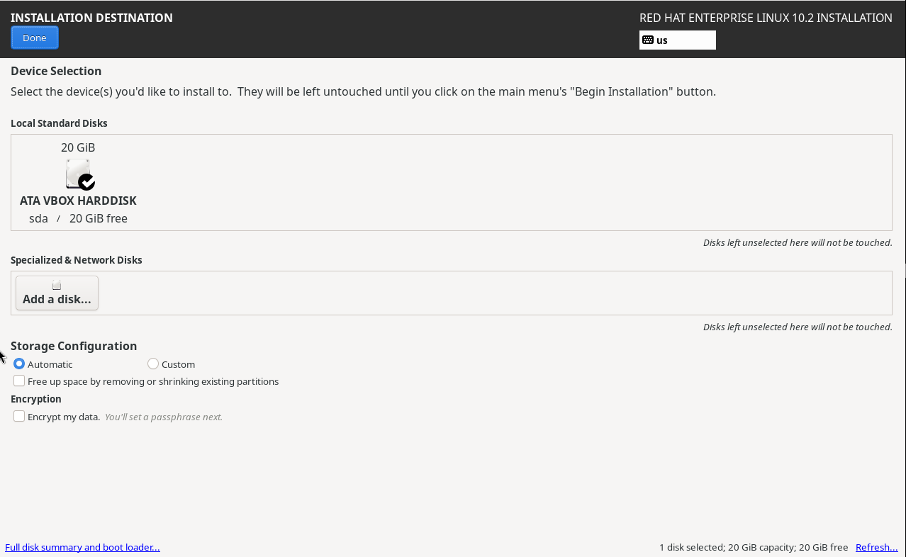

- **Local Standard Disks:** the 20 GiB VirtualBox disk (`sda`) is selected.
- **Storage Configuration:** Automatic. The installer creates the partition layout itself.
- **Encryption:** unchecked.
- Nothing is written to disk until you click **Begin Installation**.

#### Network and host name

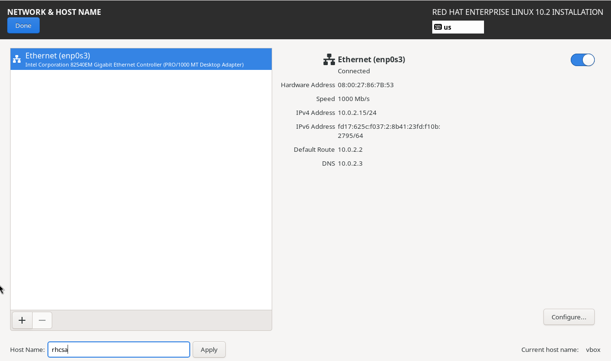

- **Ethernet (`enp0s3`):** switched on, so the VM gets an address from VirtualBox NAT.
  - IPv4: `10.0.2.15/24`
  - Default route: `10.0.2.2`
  - DNS: `10.0.2.3`
- **Host name:** `rhcsa`. Click **Apply**, or "Current host name" keeps showing `vbox`.

#### Track the installation from the host

The VM is called `rhel10`. These commands run on the host, not inside the VM.

**Watch the disk grow.** The disk is dynamically allocated, so the `.vdi` file grows as packages are written. When it stops growing, the install is nearly done.

```bash
watch -n5 'ls -lh ~/"VirtualBox VMs"/rhel10/rhel10.vdi'
```

```
-rw------- 1 user user 3.3G ... ~/VirtualBox VMs/rhel10/rhel10.vdi
```

**Check that the VM is running:**

```bash
VBoxManage showvminfo rhel10 --machinereadable | grep VMState=
```

```
VMState="running"
```

**Take a screenshot of the VM screen** to see the progress without switching windows:

```bash
VBoxManage controlvm rhel10 screenshotpng ~/rhel10-screen.png && xdg-open ~/rhel10-screen.png
```

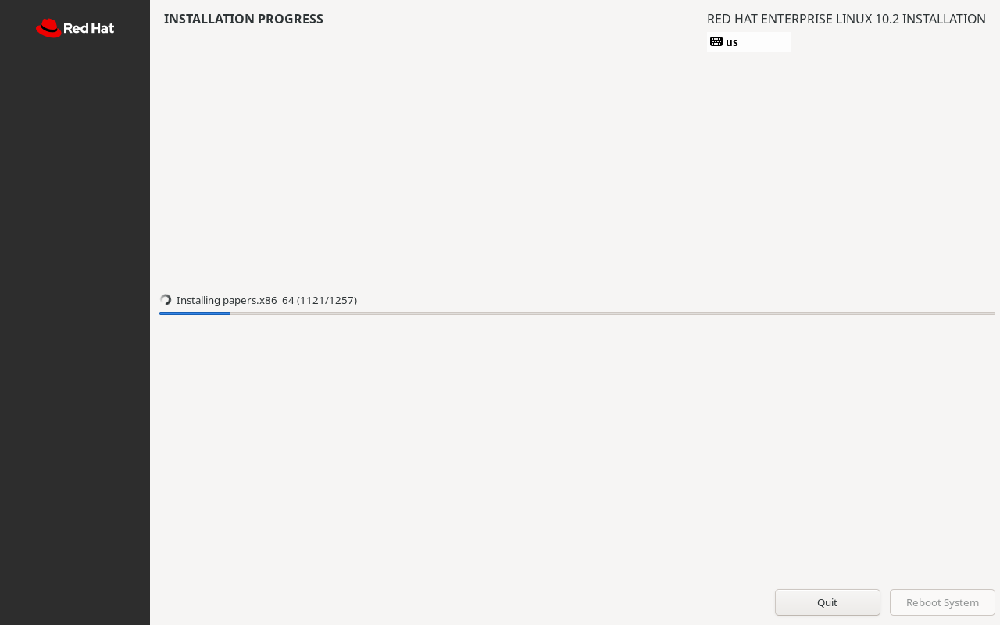

It was installing package 1121 of 1257. The progress bar looks almost empty because it also covers the steps after the packages (bootloader, initramfs, SELinux relabel).

**Follow the VirtualBox log** for the VM:

```bash
tail -f ~/"VirtualBox VMs"/rhel10/Logs/VBox.log
```

```
00:20:52.476520 GUI: UIMachineViewNormal::resendSizeHint: Restoring guest size-hint for screen 0 to 800x600
00:52:23.700496 AsyncCompletion: Task 0x007fa40f0d9dc0 completed after 16 seconds
```

When **Reboot System** becomes clickable, the install is done. Eject the ISO first (Devices → Optical Drives) so the VM boots from disk.

A system message appeared asking for registration. I'm not doing it because registering the system requires internet access, and in the exam I won't have internet access. I will need an alternative way to set up a system.

#### Using Custom Partitioning

Linux servers use multiple storage volumes:

- **Partitions:** the base solution for separate storage areas
- **Logical volumes (LVM):** an alternative to partitions

Linux servers need 3 different areas for storing data:

1. A small partition containing the Linux kernel and related files (`/boot`)
2. A small partition containing the UEFI boot loader files (`/boot/efi`, on UEFI systems)
3. The root partition containing essential OS files (`/`)

Other data that is often organized on dedicated partitions:

- Log files
- User home directories
- Server document roots
- Container images, and more

#### Using RHEL in Cloud

Using RHEL in cloud is different. In cloud RHEL is deployed, not installed. The cloud provides the boot procedure, not Linux.

---

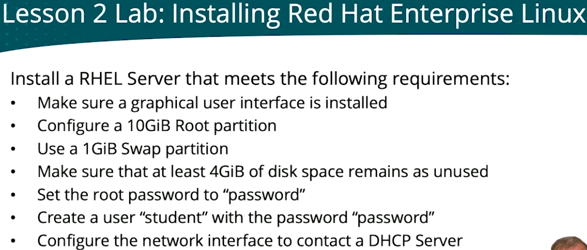

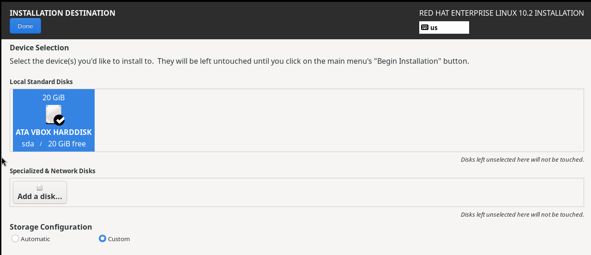

Click **Done**. After clicking **Done**, a second page opened.

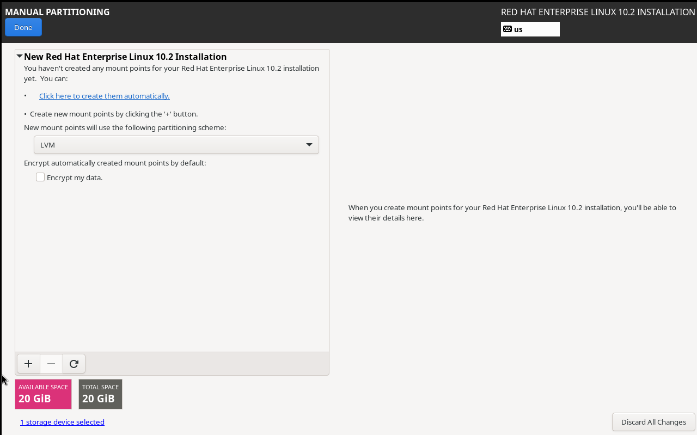

Select **Standard Partition** and click **+**.


Click **Add mount point**.

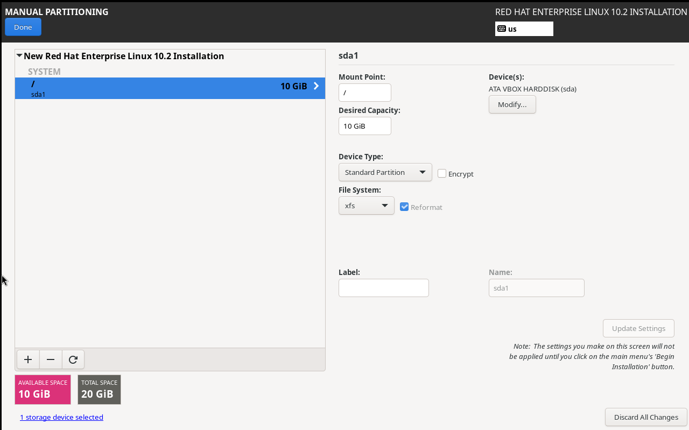

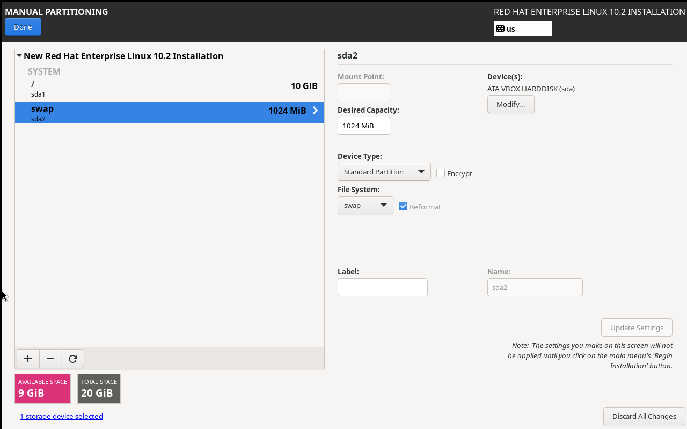

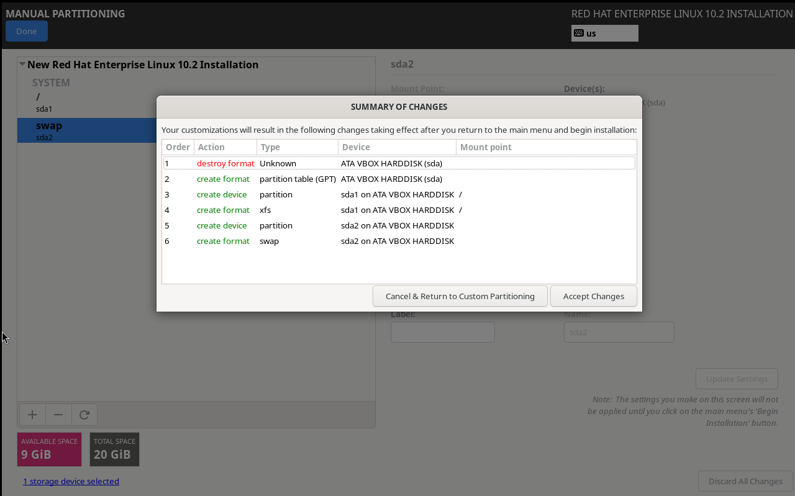

**What's wrong:** the summary only creates `/` (`sda1`) and swap (`sda2`) on a new GPT partition table. A GPT disk also needs a small partition for the boot loader, otherwise the system won't boot. The lab doesn't list it because it's a technical requirement, not a lab task. Adding it doesn't break the lab: root stays 10 GiB, swap 1 GiB, and over 4 GiB stays unused.

Which partition depends on the VM firmware:

- **BIOS** (VirtualBox default): a `biosboot` partition of 1 MiB
- **UEFI**: a `/boot/efi` partition of about 600 MiB

Check the firmware from the host:

```bash
VBoxManage showvminfo rhel10 --machinereadable | grep -i '^firmware='
```

```
firmware="BIOS"
```

Fix: click **Cancel & Return to Custom Partitioning**, then click **+** to add the boot partition.

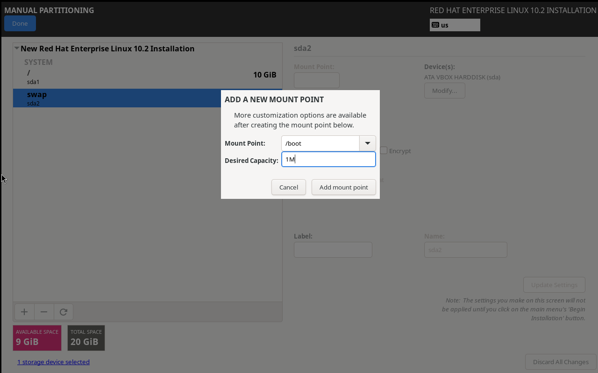

The mount point must be `biosboot`, not `/boot`. `/boot` holds the kernel and needs about 1 GiB; `biosboot` is the 1 MiB partition the boot loader needs on a BIOS VM. If it's not in the dropdown, type it.

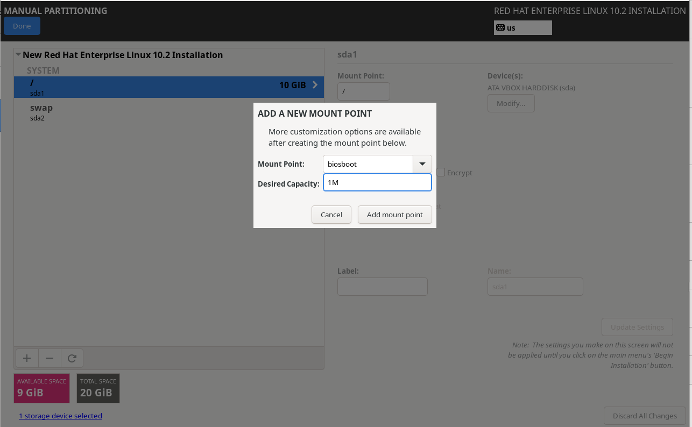

Final partition layout:

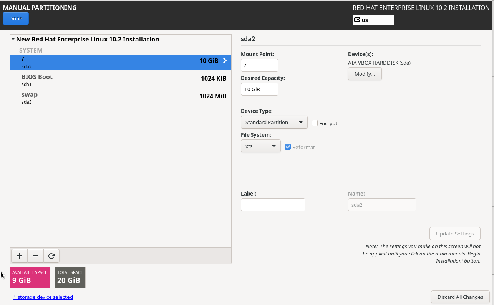

| Partition | Mount point | Size | File system |
|-----------|-------------|------|-------------|
| `sda1`    | BIOS Boot   | 1 MiB | — |
| `sda2`    | `/`         | 10 GiB | xfs |
| `sda3`    | swap        | 1 GiB | swap |

The installer puts BIOS Boot first as `sda1`, so the other partitions move to `sda2` and `sda3`. 9 GiB stays unused, so the lab's "at least 4 GiB unused" requirement is met.

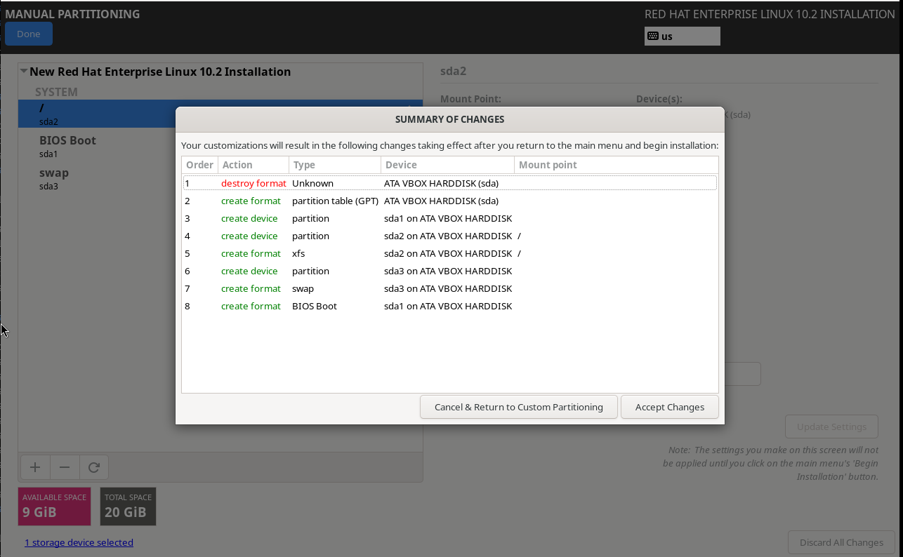

Nothing wrong: click **Accept Changes**.

Set the root password (lab requirement): select **Enable root account** and enter the password. It fails the dictionary check, so press **Done** twice.

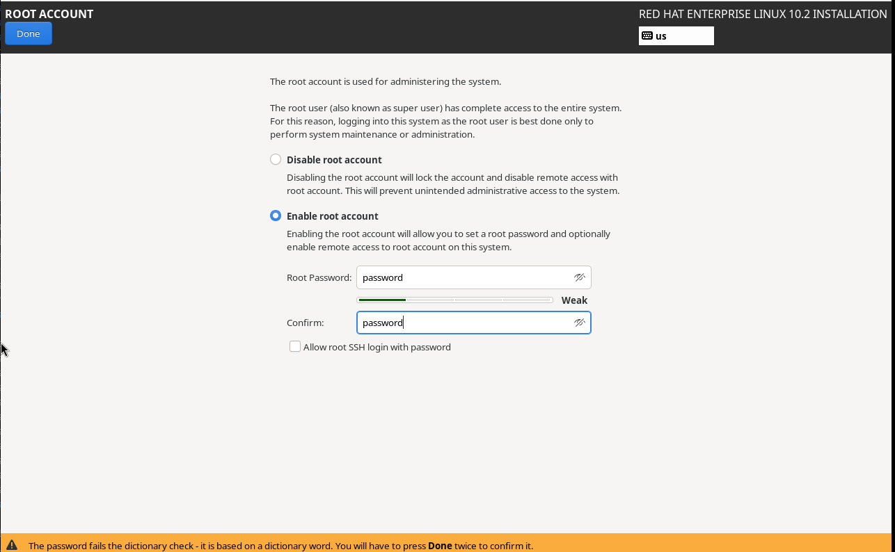

Create the user `student` (lab requirement). The weak password needs **Done** twice too.

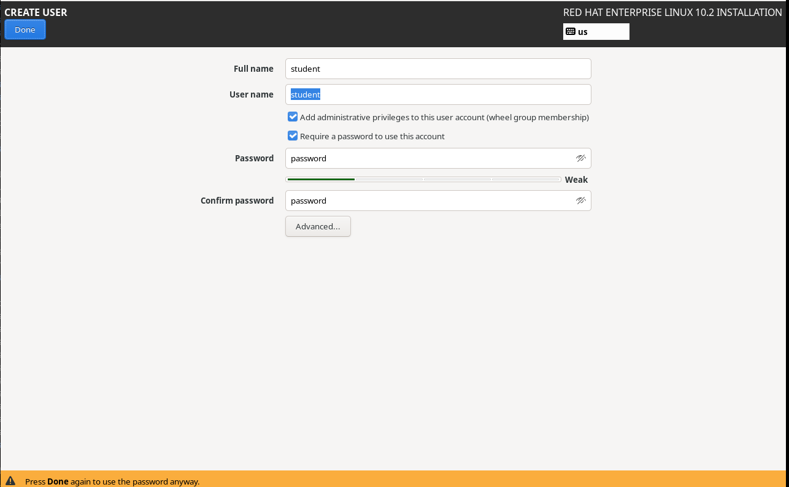

Configure the network interface to use DHCP (lab requirement). DHCP is the default, so turn the interface **ON**. It shows **Connected** with an IPv4 address from the VirtualBox DHCP server:

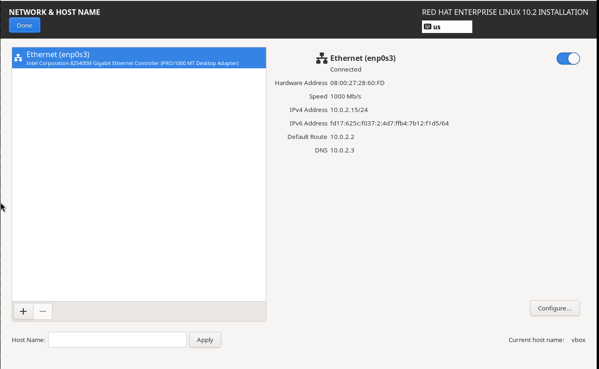

Click **Configure…** and check that the interface comes up on every boot. On the **General** tab, **Connect automatically with priority** is checked:

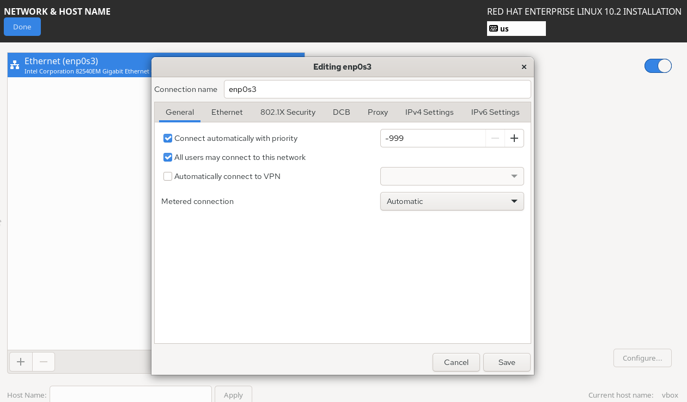

On the **IPv4 Settings** tab, **Method** is **Automatic (DHCP)**. Click **Save**.

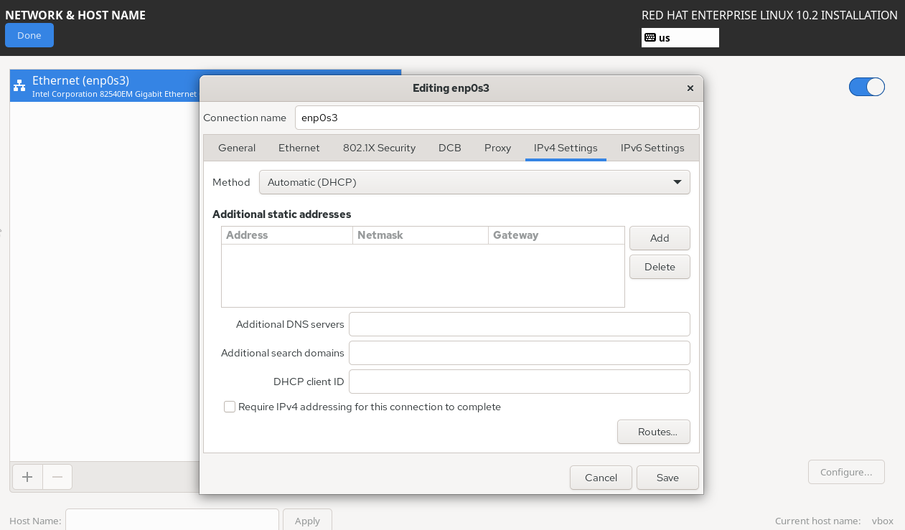

Set the host name to `rhcsa` and click **Apply**. "Current host name" changes from `vbox` only after **Apply**.

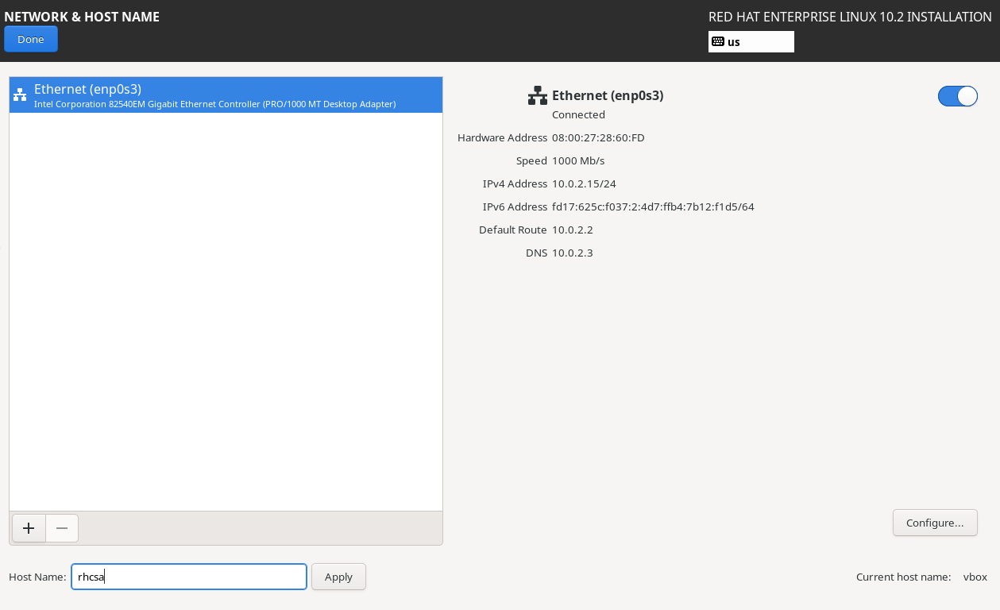

After the first boot, check DHCP from the terminal:

```bash
nmcli connection show enp0s3 | grep -E 'ipv4.method|autoconnect'
```

`ipv4.method: auto` means DHCP, and `connection.autoconnect: yes` means it comes up on boot.
