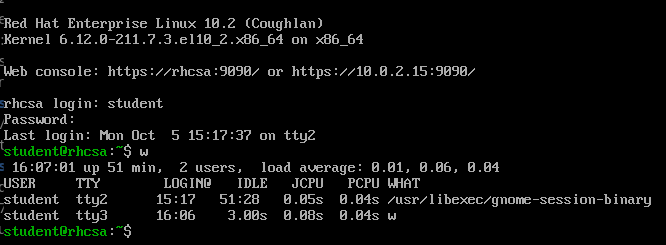
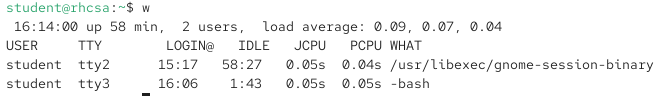
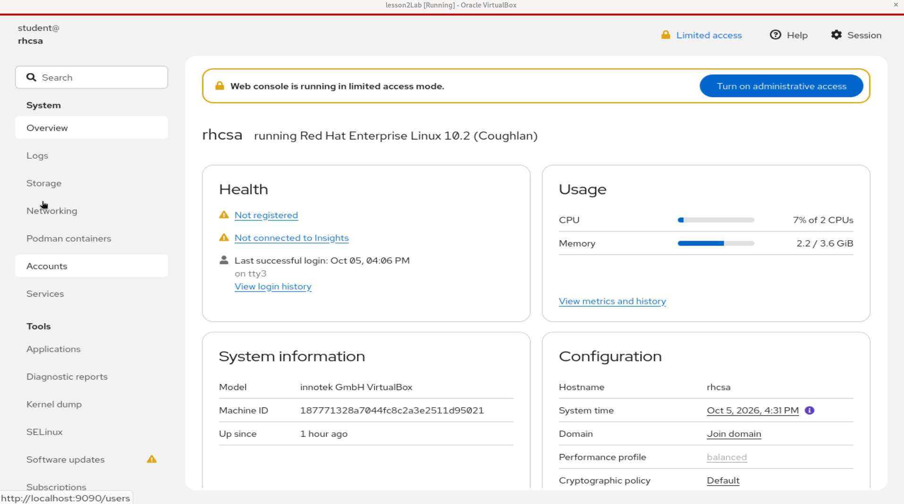
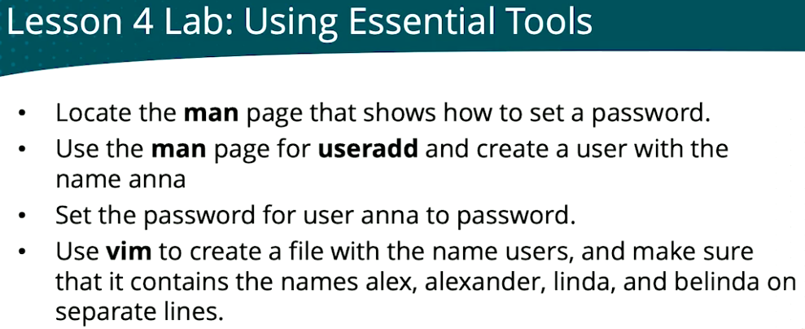
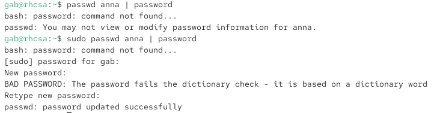
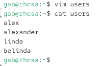
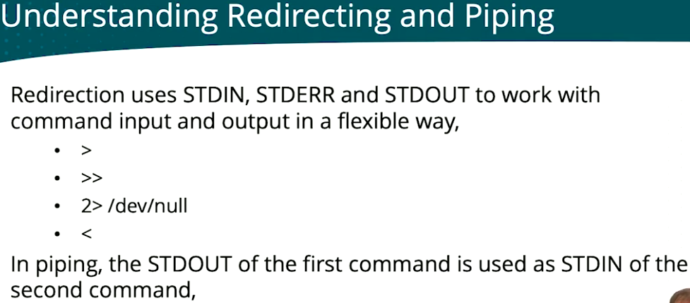
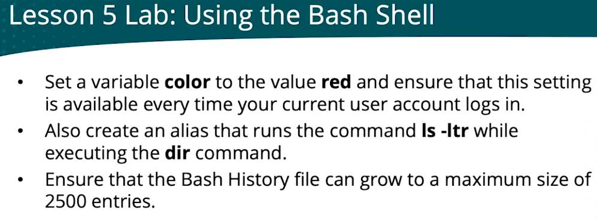

# Day 1

**Course:** [Red Hat RHCSA RHEL 10 with Exam Labs](https://learning.oreilly.com/course/red-hat-rhcsa/9780135493137/) by Sander van Vugt (Pearson, O'Reilly Learning)

## Contents

- [Module 1: Performing Basic System Management Tasks](#module-1-performing-basic-system-management-tasks)
  - [Lesson 1: Understanding RHEL](#lesson-1-understanding-rhel)
  - [Lesson 2: Installing RHEL Server](#lesson-2-installing-rhel-server)
    - [Planning the installation](#planning-the-installation)
    - [Check CPU support](#check-cpu-support)
    - [Download and verify the RHEL 10 ISO](#download-and-verify-the-rhel-10-iso)
    - [Create the VM](#create-the-vm)
    - [Installer configuration](#installer-configuration)
    - [Create the user](#create-the-user)
    - [Installation destination](#installation-destination)
    - [Network and host name](#network-and-host-name)
    - [Track the installation from the host](#track-the-installation-from-the-host)
    - [Using Custom Partitioning](#using-custom-partitioning)
    - [Using RHEL in Cloud](#using-rhel-in-cloud)
- [Module 2: Basic Tasks](#module-2-basic-tasks)
  - [Virtual terminals](#virtual-terminals)
  - [Cockpit](#cockpit)
  - [man pages](#man-pages)
  - [Lightspeed](#lightspeed)
  - [Lesson 4 lab: Using Essential Tools](#lesson-4-lab-using-essential-tools)
    - [Task 1: Locate the man page that shows how to set a password](#task-1-locate-the-man-page-that-shows-how-to-set-a-password)
    - [Task 2: Use the man page for useradd and create the user anna](#task-2-use-the-man-page-for-useradd-and-create-the-user-anna)
    - [Task 3: Set the password for user anna](#task-3-set-the-password-for-user-anna)
    - [Task 4: Use vim to create the file users](#task-4-use-vim-to-create-the-file-users)
  - [Redirecting and piping](#redirecting-and-piping)
  - [history](#history)
  - [Lesson 5 lab: Using the Bash Shell](#lesson-5-lab-using-the-bash-shell)
    - [Task 1: Set the variable color to red at every login](#task-1-set-the-variable-color-to-red-at-every-login)
    - [Task 2: Create the alias dir that runs ls -ltr](#task-2-create-the-alias-dir-that-runs-ls--ltr)
    - [Task 3: History file up to 2500 entries](#task-3-history-file-up-to-2500-entries)

---

## Module 1: Performing Basic System Management Tasks

### Lesson 1: Understanding RHEL

Linux is a UNIX-like OS: inspired by UNIX.

**The RHEL family:**

| Distribution | Role |
|---------------|------|
| Fedora       | Latest developments; less focus on stability |
| CentOS Stream | Upstream of RHEL: what has matured in Fedora, previewing the next RHEL release |
| RHEL         | Enterprise release with a 10-year lifecycle |
| AlmaLinux, Rocky Linux, Amazon Linux | Other RHEL-family distributions |

### Lesson 2: Installing RHEL Server

#### Planning the installation

What's needed depends on the requirements:

- Physical, cloud or virtual installation?
- With or without a GUI?
- What will the server be used for?

In real life, the answers to these questions drive the installation choices.

#### Check CPU support

RHEL 10 requires a CPU with AVX2 (x86-64-v3). Check on the host:

```bash
grep -o -m1 avx2 /proc/cpuinfo
```

- Prints `avx2` → good.
- Prints nothing → RHEL 10 won't boot. Use **AlmaLinux 10** (x86-64-v2 build) instead.

#### Download and verify the RHEL 10 ISO

There is only one option to download: **Red Hat Enterprise Linux 10.2** → **x86_64** → **DVD ISO** (~10 GB).

Move it next to the VMs and verify the checksum (shown under the DVD ISO link):

```bash
mv ~/Downloads/rhel-10.2-x86_64-dvd.iso ~/"VirtualBox VMs"/
echo "e15cb333529c332e76e4b1b946efe3515c99f996546675aec18e8effdf2540a5  $HOME/VirtualBox VMs/rhel-10.2-x86_64-dvd.iso" | sha256sum -c
```

Expected: `...rhel-10.2-x86_64-dvd.iso: OK`. It takes a minute or two and prints nothing until done.

#### Create the VM

VM requirements:

- 2 GiB of RAM (4 GiB recommended)
- 20 GiB of disk space: VDI, dynamically allocated (not pre-allocated)
- Network connection
- Optical drive or access to the DVD ISO
- **Skip Unattended Installation:** checked

#### Installer configuration

- **Keyboard:** US
- **Language:** English (US)

#### Create the user

A user account must be created during installation.


- **Add administrative privileges (wheel group):** checked. Members of `wheel` can use `sudo`.
- **Require a password:** checked.
- A weak password is fine for the lab: click **Done** twice to accept it.
- The root account is set separately on the summary screen and is disabled by default.

After creating an admin user, the root account warning on the summary screen disappeared: an admin (wheel) user is enough, so root can stay disabled.

#### Installation destination


- **Local Standard Disks:** the 20 GiB VirtualBox disk (`sda`) is selected.
- **Storage Configuration:** Automatic. The installer creates the partition layout itself.
- **Encryption:** unchecked.
- Nothing is written to disk until you click **Begin Installation**.

#### Network and host name


- **Ethernet (`enp0s3`):** switched on, so the VM gets an address from VirtualBox NAT.
  - IPv4: `10.0.2.15/24`
  - Default route: `10.0.2.2`
  - DNS: `10.0.2.3`
- **Host name:** `rhcsa`. Click **Apply**, or "Current host name" keeps showing `vbox`.

#### Track the installation from the host

The VM is called `rhel10`. These commands run on the host, not inside the VM.

**Watch the disk grow.** The disk is dynamically allocated, so the `.vdi` file grows as packages are written. When it stops growing, the install is nearly done.

```bash
watch -n5 'ls -lh ~/"VirtualBox VMs"/rhel10/rhel10.vdi'
```

```
-rw------- 1 user user 3.3G ... ~/VirtualBox VMs/rhel10/rhel10.vdi
```

**Check that the VM is running:**

```bash
VBoxManage showvminfo rhel10 --machinereadable | grep VMState=
```

```
VMState="running"
```

**Take a screenshot of the VM screen** to see the progress without switching windows:

```bash
VBoxManage controlvm rhel10 screenshotpng ~/rhel10-screen.png && xdg-open ~/rhel10-screen.png
```


It was installing package 1121 of 1257. The progress bar looks almost empty because it also covers the steps after the packages (bootloader, initramfs, SELinux relabel).

**Follow the VirtualBox log** for the VM:

```bash
tail -f ~/"VirtualBox VMs"/rhel10/Logs/VBox.log
```

```
00:20:52.476520 GUI: UIMachineViewNormal::resendSizeHint: Restoring guest size-hint for screen 0 to 800x600
00:52:23.700496 AsyncCompletion: Task 0x007fa40f0d9dc0 completed after 16 seconds
```

When **Reboot System** becomes clickable, the install is done. Eject the ISO first (Devices → Optical Drives) so the VM boots from disk.

A system message appeared asking for registration. I'm not doing it because registering the system requires internet access, and in the exam I won't have internet access. I will need an alternative way to set up a system.

#### Using Custom Partitioning

Linux servers use multiple storage volumes:

- **Partitions:** the base solution for separate storage areas
- **Logical volumes (LVM):** an alternative to partitions

Linux servers need 3 different areas for storing data:

1. A small partition containing the Linux kernel and related files (`/boot`)
2. A small partition containing the UEFI boot loader files (`/boot/efi`, on UEFI systems)
3. The root partition containing essential OS files (`/`)

Other data that is often organized on dedicated partitions:

- Log files
- User home directories
- Server document roots
- Container images, and more

#### Using RHEL in Cloud

Using RHEL in cloud is different. In cloud RHEL is deployed, not installed. The cloud provides the boot procedure, not Linux.

---


Click **Done**. After clicking **Done**, a second page opened.


Select **Standard Partition** and click **+**.


Click **Add mount point**.


**What's wrong:** the summary only creates `/` (`sda1`) and swap (`sda2`) on a new GPT partition table. A GPT disk also needs a small partition for the boot loader, otherwise the system won't boot. The lab doesn't list it because it's a technical requirement, not a lab task. Adding it doesn't break the lab: root stays 10 GiB, swap 1 GiB, and over 4 GiB stays unused.

Which partition depends on the VM firmware:

- **BIOS** (VirtualBox default): a `biosboot` partition of 1 MiB
- **UEFI**: a `/boot/efi` partition of about 600 MiB

Check the firmware from the host:

```bash
VBoxManage showvminfo rhel10 --machinereadable | grep -i '^firmware='
```

```
firmware="BIOS"
```

Fix: click **Cancel & Return to Custom Partitioning**, then click **+** to add the boot partition.


The mount point must be `biosboot`, not `/boot`. `/boot` holds the kernel and needs about 1 GiB; `biosboot` is the 1 MiB partition the boot loader needs on a BIOS VM. If it's not in the dropdown, type it.

Alternative (used in the course, on a UEFI VM): mount point `/boot/efi` with `600M`.


Final partition layout:


| Partition | Mount point | Size | File system |
|-----------|-------------|------|-------------|
| `sda1`    | BIOS Boot   | 1 MiB | — |
| `sda2`    | `/`         | 10 GiB | xfs |
| `sda3`    | swap        | 1 GiB | swap |

The installer puts BIOS Boot first as `sda1`, so the other partitions move to `sda2` and `sda3`. 9 GiB stays unused, so the lab's "at least 4 GiB unused" requirement is met.


Nothing wrong: click **Accept Changes**.

Set the root password (lab requirement): select **Enable root account** and enter the password. It fails the dictionary check, so press **Done** twice.


Create the user `student` (lab requirement). The weak password needs **Done** twice too.


Configure the network interface to use DHCP (lab requirement). DHCP is the default, so turn the interface **ON**. It shows **Connected** with an IPv4 address from the VirtualBox DHCP server:


Click **Configure…** and check that the interface comes up on every boot. On the **General** tab, **Connect automatically with priority** is checked:


On the **IPv4 Settings** tab, **Method** is **Automatic (DHCP)**. Click **Save**.


Set the host name to `rhcsa` and click **Apply**. "Current host name" changes from `vbox` only after **Apply**.


After the first boot, check DHCP from the terminal:

```bash
nmcli connection show enp0s3 | grep -E 'ipv4.method|autoconnect'
```

`ipv4.method: auto` means DHCP, and `connection.autoconnect: yes` means it comes up on boot.

## Module 2: Basic Tasks

### Virtual terminals

Virtual terminals start additional terminal sessions. Switch to them with **Ctrl+Alt+Fn** (from a graphical session) or **Alt+Fn** (from a text console), where *n* is the terminal number.

To see which users are logged in and on which terminals, use `who` or `w`:

```bash
who
w
```
- `who`: users, their terminal (`tty1`, `pts/0`…) and login time
- `w`: the same, plus idle time, load average and what each user is running

Example:

1. In the GUI terminal, switch to tty3:

   ```bash
   sudo chvt 3
   ```

2. On tty3, log in as `student` and run:

   ```bash
   w
   ```



- `tty2`: the graphical session (`gnome-session-binary`), logged in at 15:17
- `tty3`: the new text login opened with `chvt 3`, running `w`

To get back to the GUI from tty3, run `chvt 2`.

In console-only mode (no GUI), use one virtual terminal to test things and another to keep a log open. Switch between them with **Ctrl+Alt+Fn**.

After `chvt 2`, running `w` again from the GUI:



The tty3 session is still open: it's idle (`1:43`) and just waiting at the `-bash` prompt. Switching terminals doesn't log out; use `exit` on tty3 to close it.

To close the tty3 session from tty2, find its session ID (the row with `tty3` in the TTY column) and terminate it:

```bash
loginctl list-sessions
loginctl terminate-session <ID>
```

No `sudo` is needed for your own sessions. Run `w` to check that tty3 is gone.

### Cockpit

Cockpit is a web console for managing the system from a browser.

I enter on cockpit using `localhost:9090` on the web browser.


Open `https://localhost:9090` in the VM's browser and log in as `student`:



- The **Overview** page shows health, CPU and memory usage, system information and configuration (host name, time, performance profile).
- The menu on the left manages logs, storage, networking, accounts, services, SELinux and more.
- It starts in **Limited access** mode. Click **Turn on administrative access** (with your password) to make changes as an admin.

> ⚠️ It is not recommended to use Cockpit for the entirety of the RHCSA. Learn to do every task from the command line.

### man pages

Use man pages for help on commands, and search inside them with `/`:

```bash
man chvt
```

- `/word`: search for *word* (Enter to run the search)
- `n` / `N`: next / previous match
- `G` (uppercase): go all the way to the end
- `q`: quit

Each man section has an intro page. Use `man n intro`, where *n* is the section number:

```bash
man 1 intro
```

- `1`: user commands
- `5`: file formats and configuration files
- `8`: system administration commands

Search all man pages by keyword (in names and short descriptions):

```bash
man -k <keyword>
```

On a fresh install it may find nothing:

```
$ man -k user
user: nothing appropriate
```

The man page database (`mandb`) is built by a scheduled task, which hadn't run yet. Build it manually, then search again:

```bash
sudo mandb
```

`man -k user` returns a lot of results. Count them (the first number is the line count, about 70 here):

```bash
man -k user | wc
```

Filter to section 1 (user commands):

```bash
man -k user | grep 1
```

`grep 1` matches a `1` anywhere in the line. To match only the section, use `grep '(1)'` or `man -k -s 1 user`.

### Lightspeed

RHEL Lightspeed is a new feature in RHEL 10: an AI command-line assistant. It's completely useless for the RHCSA exam, since it needs internet access and a registered system, and the exam has neither.

Trying to install it on the unregistered VM:

```
$ sudo dnf install command-line-assistant
This system is not registered with an entitlement server. You can use "rhc" or "subscription-manager" to register.
```

An unregistered system has no access to Red Hat's online repositories, so `dnf` can't find the package. Even if installed, Lightspeed only works on a registered system with internet access. To install packages without registering, set up the RHEL ISO as a local repository (an RHCSA objective).

### Lesson 4 lab: Using Essential Tools



#### Task 1: Locate the man page that shows how to set a password

`man -k password` returns too many lines:

```
$ man -k password | wc
     71     620    4346
```

Filter to section 1 (user commands):

```
$ man -k password | grep 1
apg (1)              - generates several random passwords
chage (1)            - change user password expiry information
expiry (1)           - check and enforce password expiration policy
git-credential-cache (1) - Helper to temporarily store passwords in memory
grub-mkpasswd-pbkdf2 (1) - generate hashed password for GRUB
htdbm (1)            - Manipulate DBM password databases
openssl-passwd (1ssl) - compute password hashes
openssl-srp (1ssl)   - maintain SRP password file
passwd (1)           - change user password
seahorse (1)         - Passwords and Keys
systemd-ask-password (1) - Query the user for a system password
systemd-tty-ask-password-agent (1) - List or process pending systemd password requests
```

The answer is `passwd (1) - change user password`. Open it:

```bash
man passwd
```

```
PASSWD(1)                    User Commands                    PASSWD(1)

NAME
       passwd - change user password
```

#### Task 2: Use the man page for useradd and create the user anna

```bash
man useradd
sudo useradd anna
```

Check that the user exists:

```bash
cat /etc/passwd
id anna
```

- `cat /etc/passwd`: lists all local users, one per line. `anna` is the last line.
- `id anna`: shows anna's UID, GID and groups, or `no such user` if it doesn't exist.

Fields in an `/etc/passwd` line: name, password placeholder (`x`), UID, GID, comment, home directory, shell. Regular users have UID 1000 or higher.

#### Task 3: Set the password for user anna



What happened:

1. `passwd anna | password` without `sudo` failed: only root can change another user's password.
2. `sudo passwd anna | password` worked, but only because `passwd` asked for the password interactively. The `| password` part is wrong: it pipes the output to a command called `password`, which doesn't exist (`command not found`).
3. The password fails the dictionary check (`BAD PASSWORD`), but root can set it anyway.

Correct way:

```bash
sudo passwd anna
```

Type the password twice when prompted.

Non-interactive alternative (RHEL), useful in scripts:

```bash
echo password | sudo passwd --stdin anna
```

Verify the password by logging in as anna:

```bash
su - anna
```


The prompt changes to `anna@rhcsa`, so the password is correct. Type `exit` to go back. A wrong password gives `su: Authentication failure`.

#### Task 4: Use vim to create the file users

```bash
vim users
```

In vim: press `i` to insert, type one name per line, press `Esc`, then `:wq` to save and quit. Check the file with `cat`:



The file contains alex, alexander, linda and belinda on separate lines.

### Redirecting and piping



### history

Write the current history from memory to the history file (`~/.bash_history`):

```bash
history -w
```

Bash normally writes the history file only when the shell exits. If the system crashes, the history isn't saved. Run `history -w` before a command that might crash the system.

If you accidentally type your password at the prompt, it's saved in the history. Find its line number with `history`, then delete that line:

```bash
history
history -d <lineNumber>
```

`history -d` only removes it from memory. If the history was already written to `~/.bash_history`, run `history -w` afterwards to overwrite the file too.

### Lesson 5 lab: Using the Bash Shell



#### Task 1: Set the variable color to red at every login

Set the variable permanently. Add it to `~/.bash_profile` (runs at login), then load it into the current shell:

```bash
echo 'export color=red' >> ~/.bash_profile
```

```bash
source ~/.bash_profile
```

Check it:

```bash
echo $color
```

| File | When it runs | Typically used for |
|------|--------------|--------------------|
| `~/.bash_profile` | Once, at **login** (tty, SSH, `su -`) | **Variables** (`export`): inherited by every program started from the session |
| `~/.bashrc` | Every new **interactive shell** (e.g. each terminal window) | **Aliases** and functions: not inherited, so they must be set in every shell |

The task says "every time your current user account **logs in**", which matches `~/.bash_profile`. On RHEL, `~/.bash_profile` also loads `~/.bashrc`, so a variable in `~/.bashrc` works too. Convention: variables in `~/.bash_profile`, aliases in `~/.bashrc`.

#### Task 2: Create the alias dir that runs ls -ltr

Typing `alias dir='ls -ltr'` only sets the alias in the current shell; it's lost at logout. Add it to `~/.bashrc` (double quotes outside, because the alias contains single quotes), then reload:

```bash
echo "alias dir='ls -ltr'" >> ~/.bashrc
```

```bash
source ~/.bashrc
```

Check it:

```bash
alias dir
```

It prints `alias dir='ls -ltr'`. Running `dir` lists files with the newest at the bottom.

#### Task 3: History file up to 2500 entries

The course solution sets only `HISTFILESIZE` (the task says "history **file**"):

```bash
echo 'HISTFILESIZE=2500' >> ~/.bashrc
source ~/.bashrc
```

| Variable | Controls |
|----------|----------|
| `HISTFILESIZE` | max entries (lines) in the history **file**, `~/.bash_history`: what the task asks for |
| `HISTSIZE` | max entries (commands) in **memory** for the session (RHEL default: 1000) |

Each command is one line in the file, so entries = lines.

> Note: the file is written from memory at logout, so with `HISTSIZE` at 1000 the file won't actually grow past 1000. To make it really reach 2500, also add `echo 'HISTSIZE=2500' >> ~/.bashrc`.

Check it:

```bash
echo $HISTFILESIZE
```

It prints `2500`. `echo $VAR` reads a variable; `VAR=value` sets it (no `$`, no spaces around `=`).
