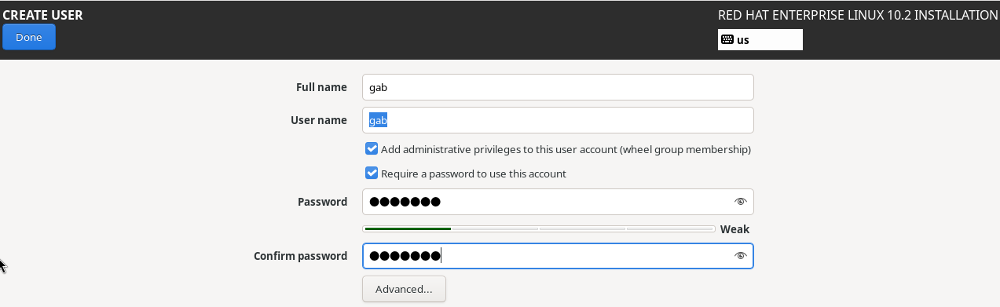

# Day 1

**Course:** [Red Hat RHCSA RHEL 10 with Exam Labs](https://learning.oreilly.com/course/red-hat-rhcsa/9780135493137/) by Sander van Vugt (Pearson, O'Reilly Learning)

---

## Module 1: Performing Basic System Management Tasks

### Lesson 1: Understanding RHEL

Linux is a UNIX-like OS: inspired by UNIX.

**The RHEL family:**

| Distribution | Role |
|---------------|------|
| Fedora       | Latest developments; less focus on stability |
| CentOS Stream | Upstream of RHEL: what has matured in Fedora, previewing the next RHEL release |
| RHEL         | Enterprise release with a 10-year lifecycle |
| AlmaLinux, Rocky Linux, Amazon Linux | Other RHEL-family distributions |

### Lesson 2: Installing RHEL Server

#### Planning the installation

What's needed depends on the requirements:

- Physical, cloud or virtual installation?
- With or without a GUI?
- What will the server be used for?

In real life, the answers to these questions drive the installation choices.

#### Check CPU support

RHEL 10 requires a CPU with AVX2 (x86-64-v3). Check on the host:

```bash
grep -o -m1 avx2 /proc/cpuinfo
```

- Prints `avx2` → good.
- Prints nothing → RHEL 10 won't boot. Use **AlmaLinux 10** (x86-64-v2 build) instead.

#### Download and verify the RHEL 10 ISO

There is only one option to download: **Red Hat Enterprise Linux 10.2** → **x86_64** → **DVD ISO** (~10 GB).

Move it next to the VMs and verify the checksum (shown under the DVD ISO link):

```bash
mv ~/Downloads/rhel-10.2-x86_64-dvd.iso ~/"VirtualBox VMs"/
echo "e15cb333529c332e76e4b1b946efe3515c99f996546675aec18e8effdf2540a5  $HOME/VirtualBox VMs/rhel-10.2-x86_64-dvd.iso" | sha256sum -c
```

Expected: `...rhel-10.2-x86_64-dvd.iso: OK`. It takes a minute or two and prints nothing until done.

#### Create the VM

VM requirements:

- 2 GiB of RAM (4 GiB recommended)
- 20 GiB of disk space: VDI, dynamically allocated (not pre-allocated)
- Network connection
- Optical drive or access to the DVD ISO
- **Skip Unattended Installation:** checked

#### Installer configuration

- **Keyboard:** US
- **Language:** English (US)

#### Create the user

A user account must be created during installation.



- **Add administrative privileges (wheel group):** checked. Members of `wheel` can use `sudo`.
- **Require a password:** checked.
- A weak password is fine for the lab: click **Done** twice to accept it.
- The root account is set separately on the summary screen and is disabled by default.

After creating an admin user, the root account warning on the summary screen disappeared: an admin (wheel) user is enough, so root can stay disabled.

#### Storage

Linux servers use multiple storage volumes:

- **Partitions:** the base solution for separate storage areas
- **Logical volumes (LVM):** an alternative to partitions

Linux servers need 3 different areas for storing data:

1. A small partition containing the Linux kernel and related files (`/boot`)
2. A small partition containing the UEFI boot loader files (`/boot/efi`, on UEFI systems)
3. The root partition containing essential OS files (`/`)

Other data that is often organized on dedicated partitions:

- Log files
- User home directories
- Server document roots
- Container images, and more
