# Day 2

**Course:** [Red Hat RHCSA RHEL 10 with Exam Labs](https://learning.oreilly.com/course/red-hat-rhcsa/9780135493137/) by Sander van Vugt (Pearson, O'Reilly Learning)

## Contents

- [Module 3: Performing Basic System Management Tasks](#module-3-performing-basic-system-management-tasks)
  - [FHS (Filesystem Hierarchy Standard)](#fhs-filesystem-hierarchy-standard)
  - [Finding files](#finding-files)
  - [Mounts and devices](#mounts-and-devices)
  - [Links](#links)
    - [ln](#ln)
  - [Lesson 6 lab: Using Essential File Management Tools](#lesson-6-lab-using-essential-file-management-tools)
    - [Task 1: Compressed archive of /etc and /opt in the home directory](#task-1-compressed-archive-of-etc-and-opt-in-the-home-directory)
    - [Task 2: Symbolic link to the archive in /tmp](#task-2-symbolic-link-to-the-archive-in-tmp)
    - [Task 3](#task-3)
  - [Viewing file contents](#viewing-file-contents)
  - [cut](#cut)
  - [sort](#sort)
  - [tr](#tr)
  - [grep](#grep)
  - [Regular expressions (basics)](#regular-expressions-basics)
  - [sed](#sed)
  - [Lesson 7 lab: Working with Text Files](#lesson-7-lab-working-with-text-files)
    - [Task 1: Line 5 of /etc/passwd with head and tail](#task-1-line-5-of-etcpasswd-with-head-and-tail)
    - [Task 2: Line 5 of /etc/passwd with sed](#task-2-line-5-of-etcpasswd-with-sed)
    - [Task 3: Last column of ps aux with awk](#task-3-last-column-of-ps-aux-with-awk)
    - [Task 4: Files in /etc with "root" as a word](#task-4-files-in-etc-with-root-as-a-word)
    - [Task 5: Lines in /etc files with exactly 3 characters](#task-5-lines-in-etc-files-with-exactly-3-characters)
    - [Task 6: Files with "alex" but not "alexander"](#task-6-files-with-alex-but-not-alexander)
  - [Root user](#root-user)
  - [Switching user with su](#switching-user-with-su)
  - [sudo](#sudo)
    - [sudo with composed commands](#sudo-with-composed-commands)
  - [SSH](#ssh)
  - [Lesson 8 lab: Configuring sudo](#lesson-8-lab-configuring-sudo)
  - [Users](#users)
    - [/etc/shadow](#etcshadow)
    - [User default settings](#user-default-settings)
    - [Limiting user access](#limiting-user-access)
  - [Groups](#groups)
  - [Password settings](#password-settings)
  - [Lesson 9 lab: Managing Users and Groups](#lesson-9-lab-managing-users-and-groups)
    - [Task 1: New users require a password with a maximal validity of 90 days](#task-1-new-users-require-a-password-with-a-maximal-validity-of-90-days)
    - [Task 2: Create an empty file newfile in every new user's home directory](#task-2-create-an-empty-file-newfile-in-every-new-users-home-directory)
    - [Task 3: Create users anna, anouk, linda and lisa](#task-3-create-users-anna-anouk-linda-and-lisa)
    - [Task 4: Set passwords for anna and anouk, disable them for linda and lisa](#task-4-set-passwords-for-anna-and-anouk-disable-them-for-linda-and-lisa)
    - [Task 5: Groups profs and students](#task-5-groups-profs-and-students)
  - [File ownership](#file-ownership)
    - [Changing file ownership](#changing-file-ownership)
  - [Permissions](#permissions)
    - [Special X](#special-x)
    - [umask](#umask)
    - [Shared group directories](#shared-group-directories)
  - [Lesson 10 lab: Managing Permissions](#lesson-10-lab-managing-permissions)

---

## Module 3: Performing Basic System Management Tasks

### FHS (Filesystem Hierarchy Standard)

The FHS defines where things live on a Linux system. The directories that matter most:

| Directory | Contains |
|-----------|----------|
| `/` | Root of the file system; everything starts here |
| `/boot` | Kernel and files needed to boot (GRUB config, initramfs) |
| `/etc` | System configuration files (`/etc/passwd`, `/etc/fstab`, service configs) |
| `/home` | Home directories of regular users (`/home/anna`) |
| `/root` | Home directory of the root user |
| `/var` | Variable data that changes while the system runs: logs (`/var/log`), mail, caches, web content (`/var/www`) |
| `/tmp` | Temporary files, cleaned up automatically |
| `/usr` | Programs, libraries and documentation (`/usr/bin`, `/usr/share/doc`, man pages) |
| `/opt` | Optional third-party software |
| `/dev` | Device files (disks such as `/dev/sda`, terminals) |
| `/proc`, `/sys` | Virtual file systems with kernel and hardware info (e.g. `/proc/cpuinfo`) |
| `/run` | Runtime data since the last boot (PID files, sockets) |
| `/mnt`, `/media` | Mount points: `/mnt` for manual mounts, `/media` for removable media |

On RHEL, `/bin`, `/sbin` and `/lib` are links to their `/usr` versions.

For the full list, run `man hier`.

### Finding files

Always use `find`, because it's the most flexible.

Search the whole file system (`/`) by name:

```bash
find / -name "hosts"
find / -name "*hosts*"
```

- `-name "hosts"`: exact name match
- `-name "*hosts*"`: any name containing `hosts` (`*` is a wildcard; keep the quotes so the shell doesn't expand it)

As a regular user, `find /` prints many `Permission denied` errors. Run it with `sudo`, or hide the errors with `2> /dev/null`.

Find files in `/etc` that contain the text `student`:

```bash
sudo find /etc -exec grep -l student {} \;
```

- `-exec <command> {} \;`: runs a command on each file found. `{}` is replaced by the file name, and `\;` ends the command.
- `grep -l`: prints only the names of files that contain the text, not the matching lines.

Add `-type f` (`find /etc -type f -exec ...`) to search only regular files and avoid `Is a directory` errors.

Hide the error messages by sending STDERR (`2>`) to `/dev/null`:

```bash
sudo find /etc -exec grep -l student {} \; 2> /dev/null
```

Copy every file that contains `student` to a directory:

```bash
mkdir -p find/contents
sudo find /etc -exec grep -l student {} \; -exec cp {} find/contents/ \; 2> /dev/null
```

- The second `-exec` runs only if the first one succeeds, so only files where `grep` found `student` are copied.
- Each `-exec` needs its own `\;` at the end. Without it, `find` fails with `missing argument to -exec`, and `2> /dev/null` hides that error, so nothing happens and nothing is shown.
- The target directory must exist first (`mkdir -p`).

Pass the results to another command with `xargs`. Find files in `/etc` that contain `127.0.0.1`:

```bash
sudo find /etc/ -name '*' -type f | xargs grep "127.0.0.1"
```

- `xargs` takes the file names from the pipe and passes them as arguments to `grep`. For example, if `find` outputs:

  ```
  /etc/hosts
  /etc/fstab
  /etc/passwd
  ```

  `xargs` turns that into one command:

  ```bash
  grep "127.0.0.1" /etc/hosts /etc/fstab /etc/passwd
  ```

  Without `xargs`, `grep` would search the *text* of the file names coming through the pipe, not the files themselves.
- `-name '*'` matches everything, so it can be left out.
- `sudo` applies only to `find`; `grep` runs as your user, so some files give `Permission denied`. Use `sudo xargs grep` to read them all.

Run the whole pipeline as root with `sudo sh -c`:

```bash
sudo sh -c "find /etc/ -name '*' -type f | xargs grep 127.0.0.1"
```

`sudo` normally applies only to the first command of a pipe. `sh -c "..."` starts a new shell as root that runs the entire command line, so both `find` and `grep` run as root and there are no `Permission denied` errors.

### Mounts and devices

Show what's mounted and which block devices exist:

```bash
mount
findmnt
lsblk
```

- `mount`: lists all mounted file systems (device, mount point, type, options). Long and hard to read, because it includes many virtual file systems.
- `findmnt`: the same information as a tree, showing which mount sits under which. Easier to read.
- `lsblk`: lists block devices (disks and partitions, such as `sda`, `sda1`) with their size, type and mount point.

`mount` output is huge because most of it is virtual file systems (`proc`, `sysfs`, `cgroup`, `tmpfs`…). Ways to filter it:

```bash
mount | grep '^/dev'   # only real disks
mount -t xfs           # only one file system type
findmnt --real         # tree without virtual file systems
findmnt /              # what's mounted at one place
df -h                  # sizes and free space
```

### Links

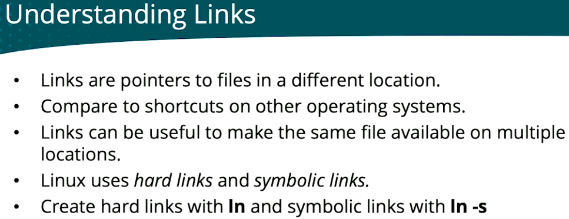

How links work:

```
name (in a directory) ──► inode ──► blocks (data on disk)
symlink ──► name ──► inode ──► blocks
```

- **Blocks**: where the file's data is physically stored.
- **Inode**: holds all the file's properties (owner, permissions, size, timestamps) and points to its blocks. Every file has exactly one inode.
- **Name**: how you reach the inode. Names are stored in directory tables.
- **Hard link**: an extra name pointing to the same inode. Every name is a hard link, so a file can have several.
  - Must be on the same file system (device), because each file system has its own inodes.
  - Can't be made for directories.
- **Symbolic link (symlink)**: points to a name, not to an inode. More flexible: it works across file systems and for directories.

| | Hard link | Symbolic link |
|---|---|---|
| Points to | inode | name (path) |
| Across file systems | no | yes |
| Directories | no | yes |
| Create with | `ln target link` | `ln -s target link` |

If the name a symlink points to is removed, the symlink becomes invalid (a *broken* or *dangling* link): it still exists but points to nothing. `ls -l` usually shows it in red.

Hard links don't have this problem: removing one name leaves the others working. The data is only deleted when the last name (hard link) to the inode is removed.

Show a file's inode number with `ls -i`:

```bash
ls -i /etc/hosts
```

The output is the inode number followed by the name. Hard links to the same file show the same inode number.

#### ln

`ln` creates links. The order is always **target first, then the new link name**:

```bash
ln <target> <link>      # hard link
ln -s <target> <link>   # symbolic link
```

Example in your home directory:

```bash
ln -s /etc/hosts symhosts    # symbolic link to /etc/hosts
touch file1
ln file1 file2               # works: same file system
ls -li file1 file2 symhosts
```

- `file1` and `file2` show the **same inode number**, and the link count (the number after the permissions) is **2**.
- `symhosts` shows `l` at the start of the permissions and `symhosts -> /etc/hosts`: it has its own inode and only stores the path.
- Removing `file1` leaves `file2` working. Removing `/etc/hosts` would break `symhosts`.

A hard link to a file on another file system fails with `Invalid cross-device link`. As a regular user, a hard link to a file you don't own (like `/etc/hosts`) fails with `Operation not permitted`, a security protection.

Use an absolute path for the target of a symlink. A relative target is resolved from the link's location, not from where you ran `ln`.

### Lesson 6 lab: Using Essential File Management Tools

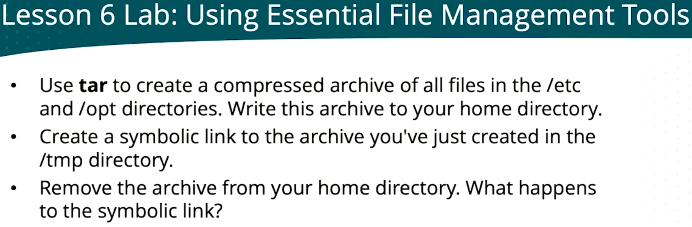

#### Task 1: Compressed archive of /etc and /opt in the home directory

One archive with both directories, compressed with gzip:

```bash
tar -czf /root/etc-opt.tar.gz /etc /opt
```
Verify:

```bash
tar tvf etc-opt.tar.gz
```

#### Task 2: Symbolic link to the archive in /tmp

```bash
ln -s /root/etc-opt.tar.gz /tmp/etc-opt.tar.gz
ls -l /tmp/rtc-opt.tar.gz
```

#### Task 3
```bash
rm etc-opt.tar.gz
```

### Viewing file contents

```bash
cat /etc/passwd    # print the whole file
tac /etc/passwd    # print the whole file, last line first
less /etc/passwd   # page through the file
more /etc/passwd   # page through the file (older, simpler)
```

- `cat`: best for short files; long files scroll past the screen.
  - `cat -A`: also shows hidden characters: `$` at each line end, `^I` for tabs. Useful to find stray spaces or tabs in config files.
- `tac`: `cat` backwards. Useful to see the newest entries of a file first.
- `less`: scroll up and down with the arrow keys, search with `/`, quit with `q` (same keys as man pages, which use `less`).
- `more`: only scrolls forward and quits at the end of the file. Use `less` instead.

Search inside `less` (for example after `less /etc/passwd`):

- `/word`: search forward for *word*, then Enter. No space after `/`, or the space becomes part of the search.

### cut

`cut` prints selected fields (columns) from each line:

```bash
cat /etc/passwd
cut -d : -f 1 /etc/passwd
```

- `cat /etc/passwd`: full lines, such as `anna:x:1001:1001::/home/anna:/bin/bash`
- `cut -d : -f 1`: only field 1 of each line, the user names
  - `-d :`: the delimiter (field separator) is `:`
  - `-f 1`: which field to print; several with `-f 1,7` (name and shell)

Sort the user names alphabetically by piping to `sort`:

```bash
cut -d : -f 1 /etc/passwd | sort
```

### sort

Sort `/etc/passwd` by UID (field 3), as numbers:

```bash
sort -t : -k3n /etc/passwd
```

- `-t :`: the field separator is `:` (like `cut -d`)
- `-k3`: sort by field 3 (the UID)
- `n`: sort numerically, so `1000` comes after `999` (alphabetically, `1000` would come before `999`)
- Add `r` (`-k3nr`) to reverse: highest UID first

### tr

`tr` translates (replaces) characters. Convert lowercase to uppercase:

```bash
echo hello | tr '[:lower:]' '[:upper:]'
```

Output: `HELLO`. `[:lower:]` and `[:upper:]` are character classes (all lowercase / all uppercase letters). Quote them: unquoted, the shell can expand `[...]` as a file name pattern if a matching one-letter file exists.

### grep

`grep` filters lines that contain a text. Find the SSH processes:

```bash
ps aux | grep ssh
```

- `ps aux`: lists all running processes
- `grep ssh`: keeps only the lines containing `ssh`

The output also includes the `grep ssh` process itself. To hide it, use `ps aux | grep '[s]sh'`, or use `pgrep -a ssh`.

`ps faux` is `ps aux` plus `f` (forest): it shows processes as a tree, so you can see which process started which (e.g. `sshd` → your login shell → `ps`).

```bash
ps faux
```

Show context around each match with `-B` (before) and `-A` (after):

```bash
ps faux | grep -B5 bash
```

- `-B5`: also print the 5 lines **before** each match. In the tree, those are the parent processes that started `bash`.
- `-A5`: 5 lines **after** each match.
- `-C5`: 5 lines before and after.

`ps faux | grep -B5 bash` is noisy: `bash` matches every shell, and `-B5` adds 5 lines per match. To see only the chain of processes that leads to your current shell:

```bash
pstree -s $$
```

- `$$`: the PID of the current shell
- `-s`: show the parents of that process

Output is one line, e.g. `systemd───gnome-terminal───bash───pstree`.

Search all files in a directory for a text:

```bash
cd /etc
grep <username> * 2>/dev/null
```

- `*`: every file in the current directory (not subdirectories)
- `2>/dev/null`: hides errors such as `Is a directory` and `Permission denied`
- Shows the files that mention the user, such as `passwd`, `group` and `subgid`
- Add `-r` to search subdirectories too, and `-l` to print only the file names: `grep -rl <username> /etc 2>/dev/null`

Search every directory and subdirectory, starting from `/`:

```bash
sudo grep -rl <word> / 2>/dev/null
```

- `-r`: recursive (every subdirectory)
- `-l`: print only file names
- `sudo`: read files only root can open

Searching all of `/` is slow and can hang on `/proc`, `/sys` and `/dev` (kernel and device interfaces, not real files). Skip them, and skip binary files:

```bash
sudo grep -rlI <word> / --exclude-dir={proc,sys,dev,run} 2>/dev/null
```

- `--exclude-dir={proc,sys,dev,run}`: skip these virtual directories
- `-I`: skip binary files (faster, no "binary file matches" noise)

Case-insensitive search with context, e.g. find the root login settings in the SSH server config:

```bash
sudo grep -i root -A5 /etc/ssh/sshd_config
```

- `-i`: ignore case, so it matches `root`, `Root` and `PermitRootLogin`
- `-A5`: also print the 5 lines after each match
- `sudo`: `sshd_config` is readable only by root

On RHEL 10, SSH settings can also be in drop-in files under `/etc/ssh/sshd_config.d/` (e.g. the installer's *Allow root SSH login with password* option). Search both:

```bash
sudo grep -ri root /etc/ssh/sshd_config /etc/ssh/sshd_config.d/
```

### Regular expressions (basics)

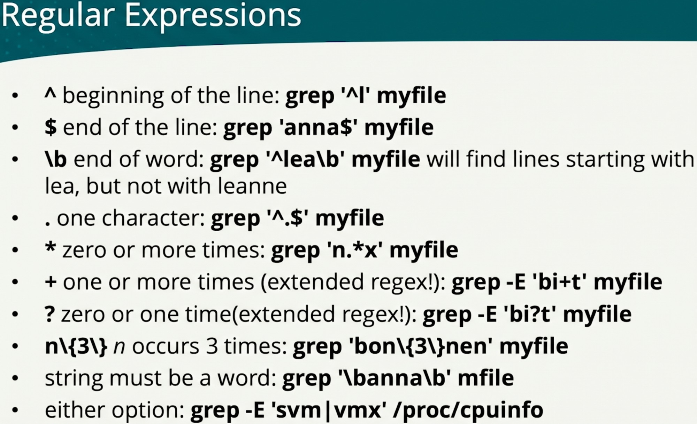

Not on the slide:

| Symbol | Meaning | Example |
|--------|---------|---------|
| `[ ]` | one of these characters | `grep '[0-9]'` |
| `-v` | invert: lines that don't match | `grep -v '^#'` |

Show a config file without comments and empty lines:

```bash
grep -v -e '^#' -e '^$' /etc/ssh/sshd_config
```

Always quote the pattern. In regex, "anything" is `.*`, not `*`.

`-E` enables extended regex, needed for `+`, `?` and `|`. Without it, `{3}` must be written `\{3\}`.

### sed

`sed` (stream editor) edits text files from the command line, without opening an editor.

```bash
sed -n 5p /etc/passwd                 # print only line 5
sed 's/anna/lisa/g' myfile            # replace anna with lisa (shows result, file unchanged)
sed -i 's/anna/lisa/g' myfile         # same, but edit the file itself
sed -i -e '2d' myfile                 # delete line 2 from the file
```

- `-n ... p`: print only the selected lines (without `-n`, every line is printed too)
- `s/old/new/`: substitute; `g` at the end replaces every match on a line, not just the first
- `-i`: in-place, changes the file. Test without `-i` first.
- `d`: delete the line

### Lesson 7 lab: Working with Text Files

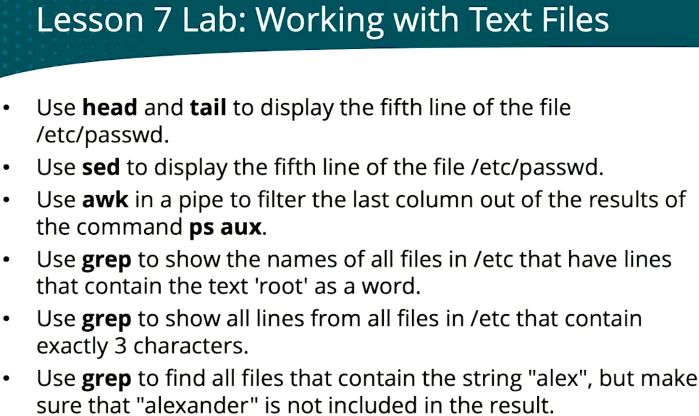

#### Task 1: Line 5 of /etc/passwd with head and tail

```bash
head -5 /etc/passwd | tail -1
head /etc/passwd --lines=5 | tail --lines=1
```

`head -5` keeps the first 5 lines; `tail -1` keeps the last of those.

#### Task 2: Line 5 of /etc/passwd with sed

```bash
sed -n 5p /etc/passwd
```

#### Task 3: Last column of ps aux with awk

```bash
ps aux | awk '{ print $NF }'
```

`NF` is the number of fields in the line, so `$NF` is the last field. Documented in `man awk` (search `/Built-in Variables`).

#### Task 4: Files in /etc with "root" as a word

```bash
grep -lw root /etc/* 2>/dev/null
```

- `-l`: file names only
- `-w`: whole word (same as `'\broot\b'`), so `rootfs` and `chroot` don't match

My first try `grep -l 'root' * /etc/*` missed "as a word" and also searched the current directory (`*`).

#### Task 5: Lines in /etc files with exactly 3 characters

```bash
grep '^...$' /etc/* 2>/dev/null
```

`^...$`: start, any 3 characters, end. No `-l`, because the task asks for the lines, not the file names.

#### Task 6: Files with "alex" but not "alexander"

```bash
grep -l '\balex\b' /etc/* 2>/dev/null
```

`\b` on both sides (or `-w alex`) matches only the whole word `alex`.

My way, testing it on a file:

```
$ echo "alex\nalexander\nlinda\nbelinda" >> users
$ cat users
alex\nalexander\nlinda\nbelinda
$ echo -e "alex\nalexander\nlinda\nbelinda" >> users
$ cat users
alex\nalexander\nlinda\nbelinda
alex
alexander
linda
belinda
$ sed -i '1d' users
$ cat users
alex
alexander
linda
belinda
$ grep 'alex\b' users
alex
```

- Without `-e`, `echo` writes `\n` literally instead of new lines.
- `echo -e` interprets `\n` as a new line.
- `sed -i '1d' users` deletes the wrong first line.
- `grep 'alex\b' users` matches `alex` but not `alexander`.

### Root user

- From a security perspective, it may be a good idea not to have an active root user (the installer's **Disable root account** option). Admin users in the `wheel` group use `sudo` instead.
- Remote root login using Secure Shell (SSH) can be allowed or not (`PermitRootLogin` in `/etc/ssh/sshd_config`, or the installer's **Allow root SSH login with password** option).
- Better avoid working as root: use an admin user account instead, and run admin commands with `sudo`.

### Switching user with su

There are two ways to work as the root user: `su -` and `sudo -i`.

- `su` switches the current user account from a shell. Useful for testing the users you've created.
- `su -` loads the complete environment of the target user. Always use `su` with `-`, so all environment variables are set the right way.
- Using `su -` to open a root shell is considered bad practice. Use `sudo -i` instead.

```bash
su - anna      # switch to anna (asks for anna's password)
sudo -i        # root shell (asks for your own password)
exit           # go back to your own user
```

`su -` to root needs the root password (and an enabled root account). `sudo -i` uses your own password, so it works when root is disabled, and every use is logged.

### sudo

The real way to perform admin tasks is `sudo`. Behind it is a detailed configuration maintained in `/etc/sudoers`. By editing `/etc/sudoers` through `visudo`, very detailed admin privileges can be assigned.

```bash
sudo visudo
```

- Always use `visudo`, never edit `/etc/sudoers` directly: it checks the syntax before saving, so a typo can't lock you out of `sudo`.

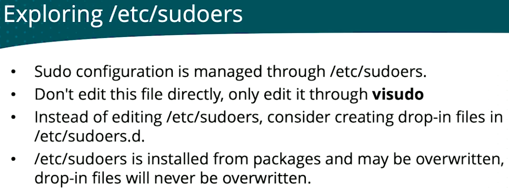

Create or edit a drop-in file, also through `visudo`:

```bash
sudo visudo -f /etc/sudoers.d/anna
```

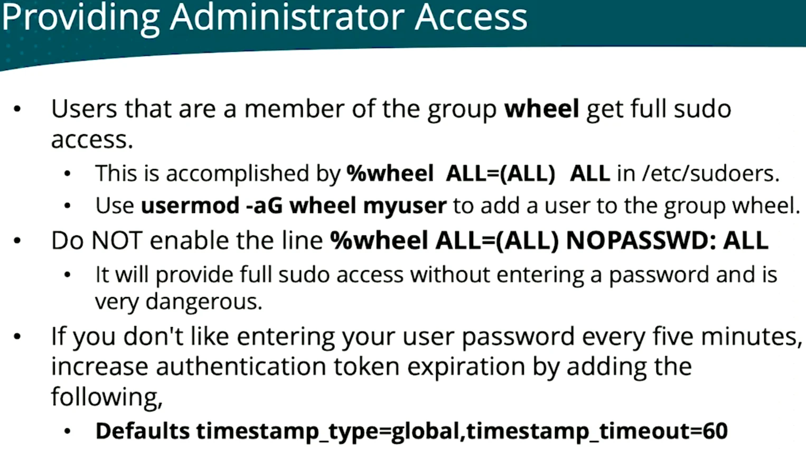

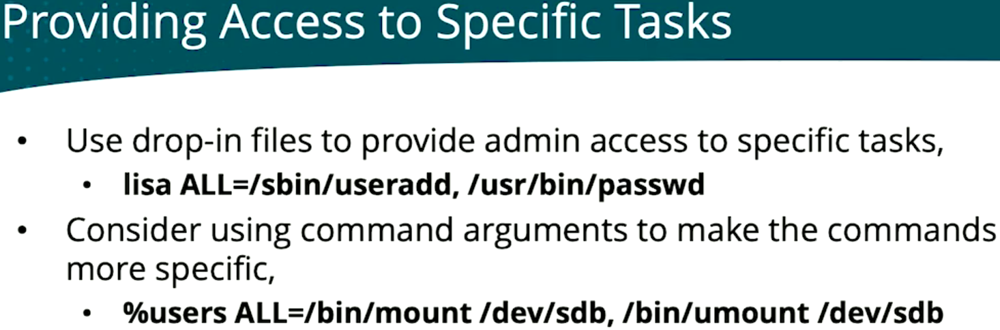

Example in a sudoers file: linda can change any user's password, except root's:

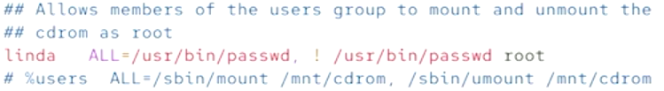

```
linda   ALL=/usr/bin/passwd, ! /usr/bin/passwd root
```

- `/usr/bin/passwd`: linda may run `passwd` as root with any arguments, so she can change (and lock or delete) the password of every user
- `! /usr/bin/passwd root`: except exactly `passwd root` (`!` means "not")
- Limit: `!` only blocks that exact command line. `sudo passwd -d root` (delete root's password) still matches the first rule, so negations in sudoers are not a real security barrier.

#### sudo with composed commands

Running composed commands (redirections, pipes) with `sudo` can be complex. The key question: **who opens the file for writing, your shell or root?**

```bash
sudo ls /root > ~/output.txt
sudo sh -c "ls /root > ~/output.txt"
```

- `sudo ls /root > ~/output.txt`: your shell handles `~` and `>` before `sudo` runs. `ls` runs as root, but the file is written by you to `/home/gab/output.txt`, owned by gab.
- `sudo sh -c "ls /root > ~/output.txt"`: the whole string runs in a root shell. `~` (inside double quotes, not expanded by your shell) becomes `/root`, so the file is `/root/output.txt`, owned by root.

The classic trap:

```bash
sudo echo hello > /root/test.txt          # Permission denied: your shell does the redirection
echo hello | sudo tee /root/test.txt      # works: tee runs as root and writes the file
```

| Command | Who writes the file | `~` is | Result |
|---------|--------------------|--------|--------|
| `sudo cmd > ~/f` | you | `/home/gab` | `/home/gab/f`, owned by gab |
| `sudo sh -c "cmd > ~/f"` | root | `/root` | `/root/f`, owned by root |
| `cmd \| sudo tee /root/f` | root | — | `/root/f`, owned by root |

### SSH

Verify that SSH is running with `systemctl`, the main management command for systemd:

```bash
systemctl status sshd
```

Look for `active (running)`. The service is called `sshd` (SSH daemon).

`scp` is part of SSH and copies files securely between hosts:

```bash
scp file.txt anna@rhcsa:/tmp/      # copy a local file to a remote host
scp anna@rhcsa:/etc/hosts .        # copy a remote file to the current directory
```

The remote side is written `user@host:path`.

### Lesson 8 lab: Configuring sudo

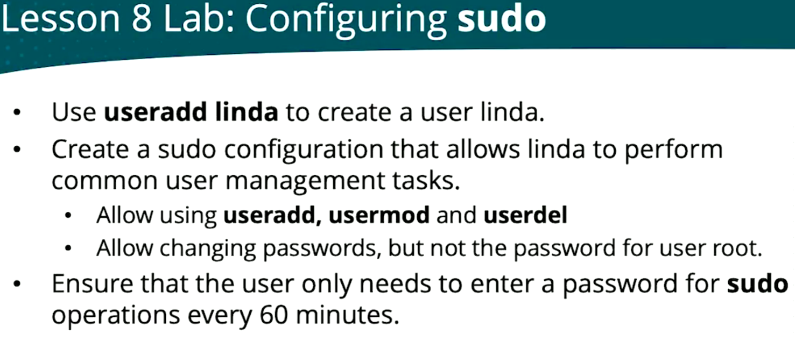

```bash
sudo useradd linda
sudo passwd linda
sudo visudo -f /etc/sudoers.d/linda
```

```
linda ALL=/usr/sbin/useradd, /usr/sbin/usermod, /usr/sbin/userdel, /usr/bin/passwd, ! /usr/bin/passwd root
Defaults timestamp_type=global,timestamp_timeout=60
```

Test as linda:

```bash
su - linda
sudo useradd johane     # works
sudo passwd johane      # works
sudo passwd root        # refused
```

`sudo passwd linda` does the same as `sudo -i`, `passwd linda`, `exit` in one command.

### Users

A user is a security principle: user accounts are used to give people or processes access to system resources.

- Processes use **system accounts** (UID below 1000, e.g. `sshd`, `chrony`).
- People use **regular user accounts** (UID 1000 and higher, e.g. `anna`, `linda`).

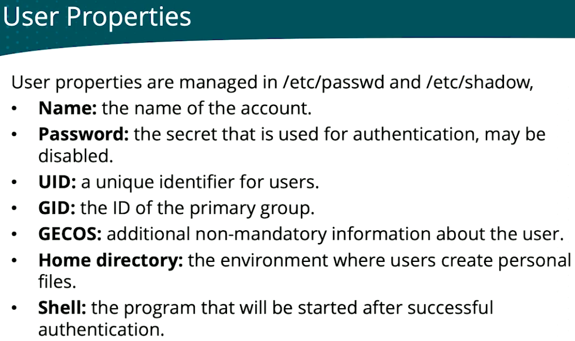

The slide's properties are the same seven fields as a line in `/etc/passwd`, in the same order:

```
anna:x:1001:1001::/home/anna:/bin/bash
name:password:UID:GID:GECOS:home:shell
```

The password field shows `x` because the real (hashed) password is kept in `/etc/shadow`, which only root can read.

#### /etc/shadow

```bash
sudo tail -5 /etc/shadow
```

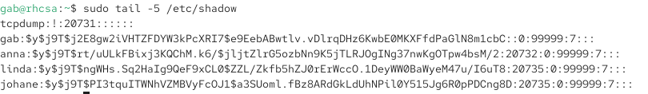

Each line has 9 fields separated by `:`:

```
anna:$y$j9T$...:20732:0:99999:7:::
name:hash:lastchg:min:max:warn:inactive:expire:reserved
```

| Field | Example | Meaning |
|-------|---------|---------|
| name | `anna` | the account |
| hash | `$y$j9T$...` | hashed password (`$y$` = yescrypt) |
| lastchg | `20732` | day of the last password change, in days since 1 January 1970 |
| min | `0` | minimum days between password changes |
| max | `99999` | maximum days a password is valid (99999 = never expires) |
| warn | `7` | days of warning before the password expires |
| inactive, expire | empty | not set |

- `!` as the hash (`tcpdump`): no usable password, nobody can log in as that account. Normal for system accounts.
- `min`, `max` and `warn` are password aging, set with `chage`.

#### User default settings

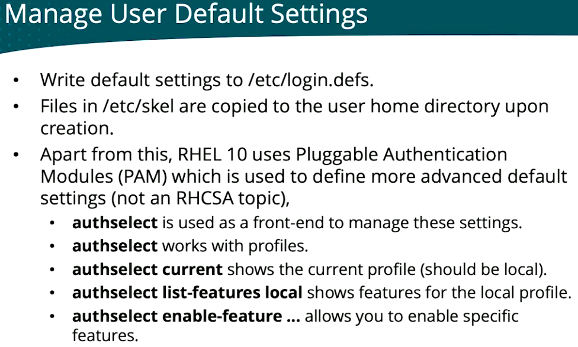

The two parts that matter for the exam:

- `/etc/login.defs` holds the defaults for new users, such as password aging (`PASS_MAX_DAYS`), UID ranges and whether a home directory is created. Changes only apply to users created afterwards.
- `/etc/skel` is copied into every new home directory. Put a file there, and every new user gets it.

#### Limiting user access

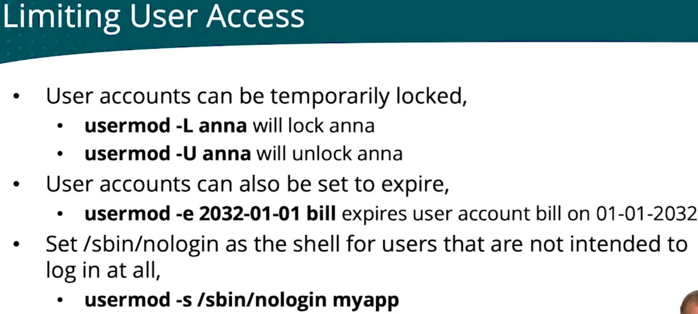

How these show up in the files:

- `usermod -L anna` puts a `!` in front of anna's hash in `/etc/shadow`, the same idea as the `tcpdump` line. `-U` removes it again.
- `usermod -e 2032-01-01 bill` fills the expire field in `/etc/shadow`. Check it with `chage -l bill`.
- `usermod -s /sbin/nologin myapp` changes the last field (shell) in `/etc/passwd`. Many system accounts already have `/sbin/nologin` there.

Check that anna is locked:

```bash
sudo usermod -L anna
sudo passwd -S anna
```

`passwd -S` shows `LK` (locked) instead of `PS`.

### Groups

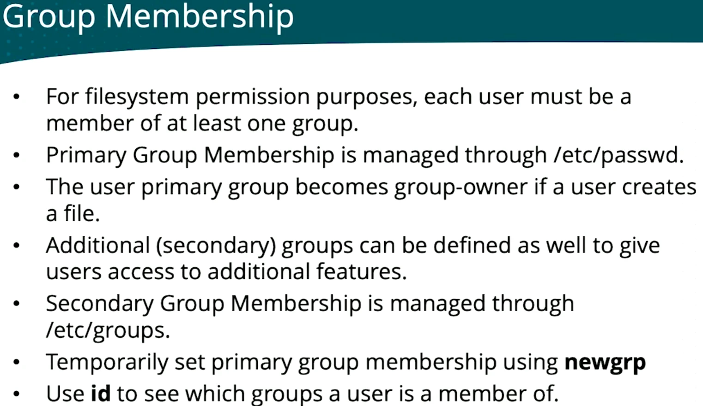

The slide says `/etc/groups`, but the file is `/etc/group`.

See a user's groups with `id`:

```bash
id gab
id linda
```

```
$ id gab
uid=1000(gab) gid=1000(gab) groups=1000(gab),10(wheel)
$ id linda
uid=1002(linda) gid=1002(linda) groups=1002(linda)
```

- `gid=`: the primary group (field 4 of `/etc/passwd`)
- `groups=`: all groups, including secondary ones (from `/etc/group`)
- `gab` is also in `wheel` (`10(wheel)`): that's what gives full `sudo` access.
- `linda` is only in her own group: her limited `sudo` rights come from the drop-in file in `/etc/sudoers.d`, not from a group.

Add a user to a secondary group:

```bash
sudo groupadd support            # the group must exist first
sudo usermod -aG support linda
id linda
```

- `-G support`: set secondary group(s)
- `-a`: append, keep the existing secondary groups
- Without `-a`, `-G` replaces all secondary groups: `usermod -G support gab` would remove gab from `wheel` (and from `sudo`).
- The new group only applies to new logins: linda must log out and back in (or use `newgrp support`).

Check the group in `/etc/group`:

```bash
grep support /etc/group
```

Output like `support:x:1005:linda`. Fields: `name:password:GID:members`. The last field lists the secondary members, separated by commas.

### Password settings

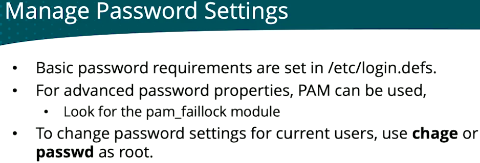

Password settings for existing users, with `chage` (changes the `min`, `max`, `warn` and `expire` fields in `/etc/shadow`):

```bash
sudo chage -l anna               # show anna's password settings
sudo chage -M 90 anna            # password expires after 90 days
sudo chage -d 0 anna             # force a new password at next login
sudo chage -E 2032-01-01 anna    # account expires on 1 January 2032
```

For new users, the defaults come from `/etc/login.defs` (e.g. `PASS_MAX_DAYS`).

### Lesson 9 lab: Managing Users and Groups


List only real human users (filter out system daemons). Most Linux distributions give normal user accounts a UID of 1000 or higher:

```bash
awk -F: '$3 >= 1000 && $3 != 65534 {print $1, "UID:" $3}' /etc/passwd
```

```
gab UID:1000
anna UID:1001
linda UID:1002
johane UID:1003
```

- `-F:`: fields are separated by `:`
- `$3 >= 1000`: field 3 (the UID) is 1000 or higher
- `$3 != 65534`: skip `nobody` (UID 65534), a system account with a high UID
- `{print $1, "UID:" $3}`: print the name and the UID

Maximum password validity of 90 days for anna, an existing user:

```bash
sudo chage -l anna
sudo chage -M 90 anna
sudo chage -l anna
```

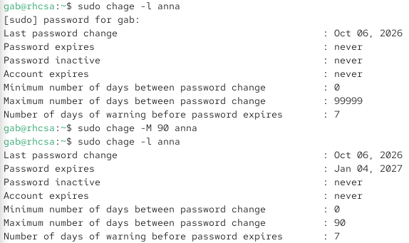

- Before: `Maximum number of days between password change : 99999`, `Password expires : never`
- After: `Maximum ... : 90`, `Password expires : Jan 04, 2027` (last change Oct 06, 2026 + 90 days)
- `chage` only changes existing users. For **new** users (what task 1 asks), set `PASS_MAX_DAYS 90` in `/etc/login.defs` before creating them.

#### Task 1: New users require a password with a maximal validity of 90 days

In `/etc/login.defs`, change `PASS_MAX_DAYS 99999` to `PASS_MAX_DAYS 90`, then create a new user and check it:

```bash
sudo vim /etc/login.defs
sudo useradd anouk
sudo chage -l anouk
```

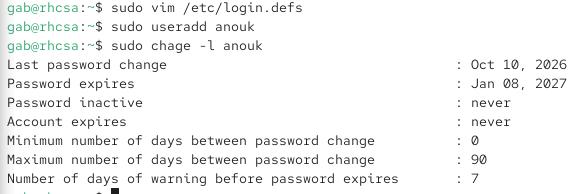

`Maximum number of days between password change : 90` and `Password expires : Jan 08, 2027`: the new user got the 90 days from `/etc/login.defs`.

#### Task 2: Create an empty file newfile in every new user's home directory

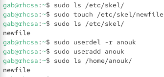

`/etc/skel` ("skeleton") is the template for new home directories. When `useradd` creates a user, it copies everything in `/etc/skel` into the new home directory, owned by the new user.

- `ls /etc/skel/` looked empty at first, but it already has hidden files (`.bashrc`, `.bash_profile`, `.bash_logout`): see them with `ls -a /etc/skel`. That's where every user's bash files come from.
- It only works at creation time: existing users don't get new files. That's why `anouk` was removed (`userdel -r`, which also deletes the home directory) and created again.

#### Task 3: Create users anna, anouk, linda and lisa

`anna`, `anouk` and `linda` already exist, so only `lisa` is new:

```bash
sudo useradd lisa
```

`lisa` gets the 90-day password limit and `newfile` automatically. `anna` and `linda` were created before tasks 1 and 2, so they don't have them.

#### Task 4: Set passwords for anna and anouk, disable them for linda and lisa

```bash
sudo passwd anouk
sudo passwd anna
```

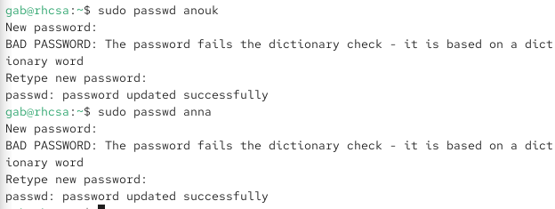

`BAD PASSWORD` is only a warning: as root, the password is set anyway.

Disable (lock) the passwords for linda and lisa, then check:

```bash
sudo passwd -l linda
sudo passwd -l lisa
sudo passwd -S linda
sudo passwd -S lisa
```

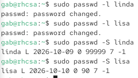

- `passwd -l` does the same as `usermod -L`: puts `!` in front of the hash in `/etc/shadow`.
- `passwd -S` fields: name, status (`L` locked, `P` password set, `NP` no password), last change, min, max, warn, inactive.
- `linda` shows max `99999`, `lisa` shows `90`: lisa was created after `PASS_MAX_DAYS 90`, linda before.

See the lock in `/etc/shadow`:

```bash
sudo grep linda /etc/shadow
```

The hash now starts with `!` (e.g. `linda:!$y$j9T$...:20735:0:99999:7:::`). Unlocking (`passwd -u` or `usermod -U`) removes the `!`, and the old password works again.

#### Task 5: Groups profs and students

```bash
sudo groupadd profs
sudo groupadd student          # typo: should be students
sudo groupdel student          # remove the wrong group
sudo groupadd students
sudo usermod -aG profs anna
sudo usermod -aG profs anouk
sudo usermod -aG students linda
sudo usermod -aG students lisa
grep -E 'profs|students' /etc/group
```

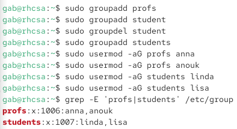

```
profs:x:1006:anna,anouk
students:x:1007:linda,lisa
```

- `groupdel` removes a group (fix for the `student` typo).
- `grep -E 'profs|students'`: `|` means "or" in extended regex.
- The last field lists the secondary members: anna and anouk in `profs`, linda and lisa in `students`.

### File ownership

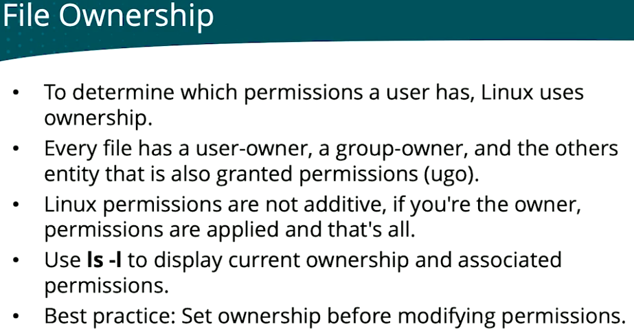

"Permissions are not additive": Linux checks in this order and stops at the first match:

1. Are you the **user-owner**? You get the owner permissions, nothing else is checked.
2. Otherwise, are you in the **group-owner**? You get the group permissions.
3. Otherwise, you get the **others** permissions.

Example: a file with `-r--rw-rw-` that you own: you **can't write** to it, even though group and others can. You only get the owner's `r--`.

Reading `ls -l`:

```
-rw-r--r--. 1 gab gab 30 Oct 6 users
 └┬┘└┬┘└┬┘    └┬┘ └┬┘
  u  g  o    owner group
```

#### Changing file ownership

- `chown user[:group] file`: set the user-owner (and optionally the group-owner)
- `chgrp group file`: set the group-owner

```bash
sudo chown anna users            # user-owner becomes anna
sudo chown anna:profs users      # user-owner anna, group-owner profs
sudo chgrp students users        # group-owner becomes students
```

Add `-R` to change a directory and everything in it.

### Permissions

| Permission | Value | On a file | On a directory |
|------------|-------|-----------|----------------|
| read (`r`) | 4 | open the file | list the files |
| write (`w`) | 2 | modify the file | add and delete files |
| execute (`x`) | 1 | run the file | `cd` into the directory |

Change permissions with `chmod`:

```bash
chmod 750 myfile      # u=rwx (4+2+1), g=r-x (4+1), o=--- (0)
chmod g+w myfile      # add write for the group
chmod o-r myfile      # remove read for others
```

- Numeric (absolute): one digit per entity, in the order user, group, others. Add the values: `rw-` = 4+2 = 6.
- Symbolic (relative): `u`, `g`, `o` (or `a` for all), then `+`, `-` or `=`, then `r`, `w`, `x`.

#### Special X

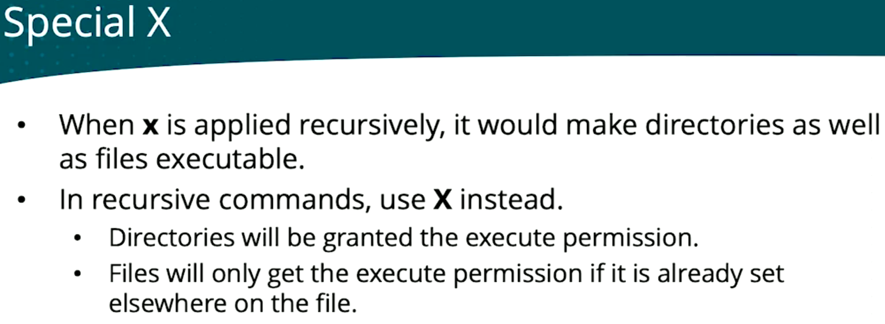

```bash
chmod -R o+X /data      # dirs get x; files only if they already have x somewhere
chmod -R o+x /data      # every file becomes executable too (usually wrong)
```

Testing `x` vs `X`:

```
~/data$ cd files/
~/data/files$ touch files{1..4}
~/data/files$ ls -l
-rw-r--r-- 1 user user 0 Oct 10 19:44 files1
-rw-r--r-- 1 user user 0 Oct 10 19:44 files2
-rw-r--r-- 1 user user 0 Oct 10 19:44 files3
-rw-r--r-- 1 user user 0 Oct 10 19:44 files4
~/data/files$ cd ..
~/data$ chmod -R +x files/
~/data$ ls -l files/
-rwxr-xr-x 1 user user 0 Oct 10 19:44 files1
-rwxr-xr-x 1 user user 0 Oct 10 19:44 files2
-rwxr-xr-x 1 user user 0 Oct 10 19:44 files3
-rwxr-xr-x 1 user user 0 Oct 10 19:44 files4
~/data$ chmod -x files/*
~/data$ ls -l files/
-rw-r--r-- 1 user user 0 Oct 10 19:44 files1
-rw-r--r-- 1 user user 0 Oct 10 19:44 files2
-rw-r--r-- 1 user user 0 Oct 10 19:44 files3
-rw-r--r-- 1 user user 0 Oct 10 19:44 files4
~/data$ chmod -R +X files/
~/data$ ls -l files/
-rw-r--r-- 1 user user 0 Oct 10 19:44 files1
-rw-r--r-- 1 user user 0 Oct 10 19:44 files2
-rw-r--r-- 1 user user 0 Oct 10 19:44 files3
-rw-r--r-- 1 user user 0 Oct 10 19:44 files4
```

- `touch files{1..4}`: brace expansion creates `files1` to `files4`.
- `chmod -R +x`: every file became executable.
- `chmod -x files/*`: removed `x` from the files again (not from the directory).
- `chmod -R +X`: the files stayed without `x`, because none of them had `x` anywhere. Only the directory `files/` gets (keeps) `x`.

#### umask

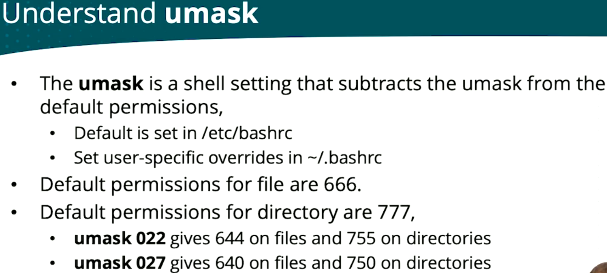

How the subtraction works, digit by digit:

| | Files | Directories |
|---|---|---|
| Default | 666 | 777 |
| umask 022 | − 022 | − 022 |
| Result | **644** (`rw-r--r--`) | **755** (`rwxr-xr-x`) |

Files start at 666, not 777, so new files are never executable. You always add `x` yourself with `chmod`.

#### Shared group directories

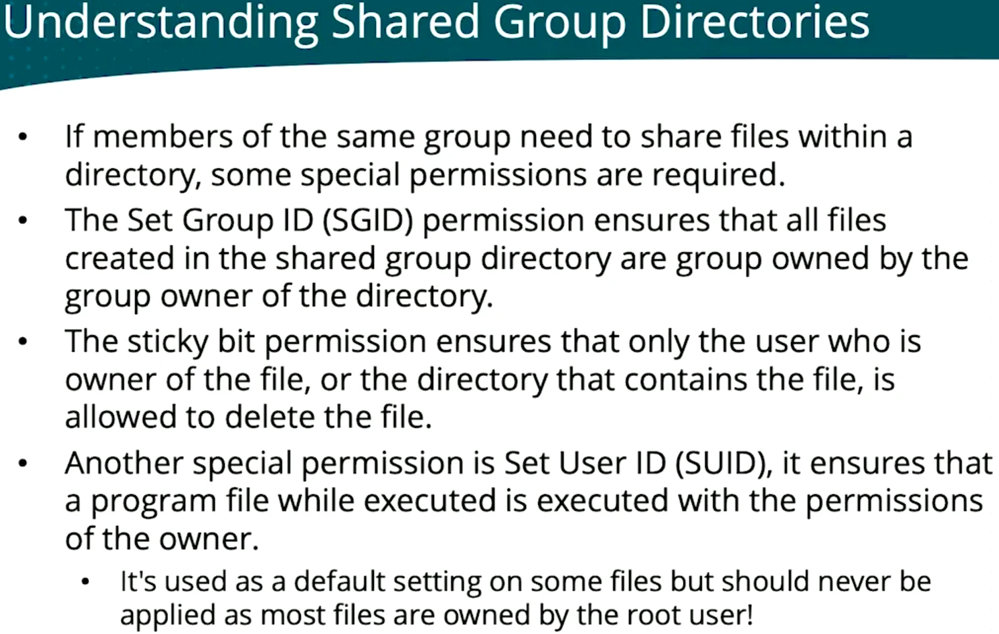

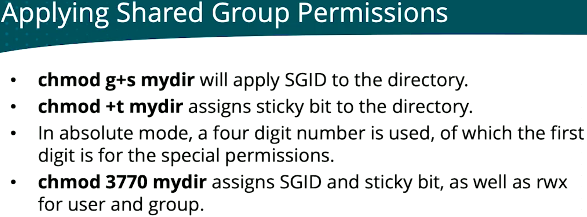

### Lesson 10 lab: Managing Permissions

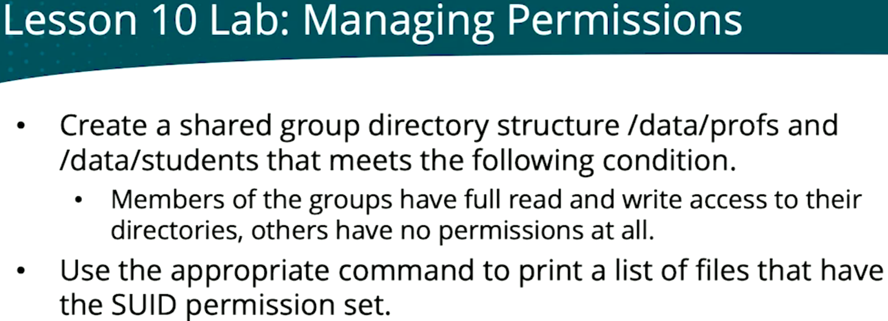
